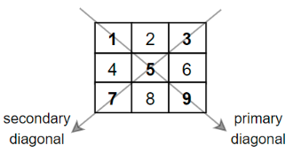

# #[1572. 矩阵对角线元素的和](https://leetcode-cn.com/problems/matrix-diagonal-sum/)

给你一个正方形矩阵 mat，请你返回矩阵对角线元素的和。

请你返回在矩阵主对角线上的元素和副对角线上且不在主对角线上元素的和。

## 示例1：

输入：mat = [[1,2,3],
            			[4,5,6],
            			[7,8,9]]
输出：25
解释：对角线的和为：1 + 5 + 9 + 3 + 7 = 25
请注意，元素 mat[1] [1] = 5 只会被计算一次。

## 示例2：

输入：mat = [[1,1,1,1],
            			[1,1,1,1],
            			[1,1,1,1],
            			[1,1,1,1]]
输出：8

## 示例3：

输入：mat = [[5]]
输出：5

## 提示：

n == mat.length == mat[i].length
1 <= n <= 100
1 <= mat [i] [j] <= 100

## 解题思路：求和就行，注意特殊元素：

~~~java
class Solution {
    public int diagonalSum(int[][] mat) {
        int sum = 0;
        for (int i = 0; i < mat.length; i++) {
            sum += mat[i][i];
            if (mat[i].length -i -1 != i)
                sum +=mat[i][mat[i].length - i - 1];
        }
        return sum;
    }
}
~~~

