# SpringBoot


## 回顾什么是Spring

Spring是一个开源框架，2003 年兴起的一个轻量级的Java 开发框架，作者：Rod Johnson  。

**Spring是为了解决企业级应用开发的复杂性而创建的，简化开发。**

## Spring是如何简化Java开发的

为了降低Java开发的复杂性，Spring采用了以下4种关键策略：

1、基于POJO的轻量级和最小侵入性编程，所有东西都是bean；

2、通过IOC，依赖注入（DI）和面向接口实现松耦合；

3、基于切面（AOP）和惯例进行声明式编程；

4、通过切面和模版减少样式代码，RedisTemplate，xxxTemplate；


## 什么是SpringBoot

学过javaweb的同学就知道，开发一个web应用，从最初开始接触Servlet结合Tomcat, 跑出一个Hello Wolrld程序，是要经历特别多的步骤；后来就用了框架Struts，再后来是SpringMVC，到了现在的SpringBoot，过一两年又会有其他web框架出现；你们有经历过框架不断的演进，然后自己开发项目所有的技术也在不断的变化、改造吗？建议都可以去经历一遍；

言归正传，什么是SpringBoot呢，就是一个javaweb的开发框架，和SpringMVC类似，对比其他javaweb框架的好处，官方说是简化开发，约定大于配置，  you can "just run"，能迅速的开发web应用，几行代码开发一个http接口。

所有的技术框架的发展似乎都遵循了一条主线规律：从一个复杂应用场景 衍生 一种规范框架，人们只需要进行各种配置而不需要自己去实现它，这时候强大的配置功能成了优点；发展到一定程度之后，人们根据实际生产应用情况，选取其中实用功能和设计精华，重构出一些轻量级的框架；之后为了提高开发效率，嫌弃原先的各类配置过于麻烦，于是开始提倡“约定大于配置”，进而衍生出一些一站式的解决方案。

是的这就是Java企业级应用->J2EE->spring->springboot的过程。

随着 Spring 不断的发展，涉及的领域越来越多，项目整合开发需要配合各种各样的文件，慢慢变得不那么易用简单，违背了最初的理念，甚至人称配置地狱。Spring Boot 正是在这样的一个背景下被抽象出来的开发框架，目的为了让大家更容易的使用 Spring 、更容易的集成各种常用的中间件、开源软件；

Spring Boot 基于 Spring 开发，Spirng Boot 本身并不提供 Spring 框架的核心特性以及扩展功能，只是用于快速、敏捷地开发新一代基于 Spring 框架的应用程序。也就是说，它并不是用来替代 Spring 的解决方案，而是和 Spring 框架紧密结合用于提升 Spring 开发者体验的工具。Spring Boot 以**约定大于配置的核心思想**，默认帮我们进行了很多设置，多数 Spring Boot 应用只需要很少的 Spring 配置。同时它集成了大量常用的第三方库配置（例如 Redis、MongoDB、Jpa、RabbitMQ、Quartz 等等），Spring Boot 应用中这些第三方库几乎可以零配置的开箱即用。

简单来说就是SpringBoot其实不是什么新的框架，它默认配置了很多框架的使用方式，就像maven整合了所有的jar包，spring boot整合了所有的框架 。

Spring Boot 出生名门，从一开始就站在一个比较高的起点，又经过这几年的发展，生态足够完善，Spring Boot 已经当之无愧成为 Java 领域最热门的技术。

**Spring Boot的主要优点：**

- 为所有Spring开发者更快的入门
- **开箱即用**，提供各种默认配置来简化项目配置
- 内嵌式容器简化Web项目
- 没有冗余代码生成和XML配置的要求

真的很爽，我们快速去体验开发个接口的感觉吧！


## Hello，World


### 准备工作

我们将学习如何快速的创建一个Spring Boot应用，并且实现一个简单的Http请求处理。通过这个例子对Spring Boot有一个初步的了解，并体验其结构简单、开发快速的特性。

我的环境准备：

- java version "1.8.0_181"
- Maven-3.6.1
- SpringBoot 2.x 最新版

开发工具：

- IDEA

  

### 创建基础项目说明

Spring官方提供了非常方便的工具让我们快速构建应用

Spring Initializr：https://start.spring.io/

**项目创建方式一：**使用Spring Initializr 的 Web页面创建项目

1、打开  https://start.spring.io/

2、填写项目信息

3、点击”Generate Project“按钮生成项目；下载此项目

4、解压项目包，并用IDEA以Maven项目导入，一路下一步即可，直到项目导入完毕。

5、如果是第一次使用，可能速度会比较慢，包比较多、需要耐心等待一切就绪。


**项目创建方式二：**使用 IDEA 直接创建项目

1、创建一个新项目

2、选择spring initalizr ， 可以看到默认就是去官网的快速构建工具那里实现

3、填写项目信息

4、选择初始化的组件（初学勾选 Web 即可）

5、填写项目路径

6、等待项目构建成功


**项目结构分析：**

通过上面步骤完成了基础项目的创建。就会自动生成以下文件。

1、程序的主启动类

2、一个 application.properties 配置文件

3、一个 测试类

4、一个 pom.xml

### pom.xml 分析

打开pom.xml，看看Spring Boot项目的依赖：

```xml
<!-- 父依赖 -->
<parent>
    <groupId>org.springframework.boot</groupId>
    <artifactId>spring-boot-starter-parent</artifactId>
    <version>2.2.5.RELEASE</version>
    <relativePath/>
</parent>

<dependencies>
    <!-- web场景启动器,web依赖 -->
    <dependency>
        <groupId>org.springframework.boot</groupId>
        <artifactId>spring-boot-starter-web</artifactId>
    </dependency>
    <!-- springboot单元测试 -->
    <dependency>
        <groupId>org.springframework.boot</groupId>
        <artifactId>spring-boot-starter-test</artifactId>
        <scope>test</scope>
        <!-- 剔除依赖 -->
        <exclusions>
            <exclusion>
                <groupId>org.junit.vintage</groupId>
                <artifactId>junit-vintage-engine</artifactId>
            </exclusion>
        </exclusions>
    </dependency>
</dependencies>

<build>
    <plugins>
        <!-- 打包插件 -->
        <plugin>
            <groupId>org.springframework.boot</groupId>
            <artifactId>spring-boot-maven-plugin</artifactId>
        </plugin>
    </plugins>
</build>
```

### 编写一个http接口

1、在主程序的同级目录下，新建一个controller包，一定要在同级目录下，否则识别不到

2、在包中新建一个HelloController类

```java
@RestControllerpublic 
class HelloController {
    @RequestMapping("/hello")    
    public String hello() {
        return "Hello World";
    }
}
```

3、编写完毕后，从主程序启动项目，浏览器发起请求，看页面返回；控制台输出了 Tomcat 访问的端口号！


简单几步，就完成了一个web接口的开发，SpringBoot就是这么简单。所以我们常用它来建立我们的微服务项目！


更改端口号：

在application.properties中：

~~~properties
server.port=8081
~~~


### 将项目打成jar包，点击 maven的 package

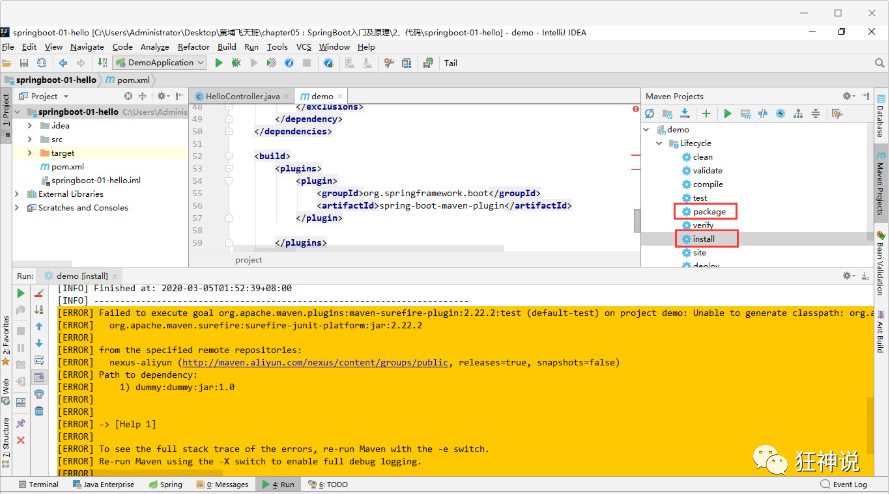

如果遇到以上错误，可以配置打包时 跳过项目运行测试用例

```xml
<!--
    在工作中,很多情况下我们打包是不想执行测试用例的
    可能是测试用例不完事,或是测试用例会影响数据库数据
    跳过测试用例执
    -->
<plugin>
    <groupId>org.apache.maven.plugins</groupId>
    <artifactId>maven-surefire-plugin</artifactId>
    <configuration>
        <!--跳过项目运行测试用例-->
        <skipTests>true</skipTests>
    </configuration>
</plugin>
```

如果打包成功，则会在target目录下生成一个 jar 包

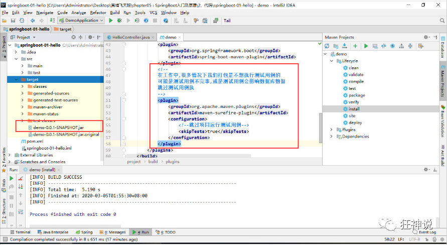

打成了jar包后，就可以在任何地方运行了！OK

### 彩蛋

如何更改启动时显示的字符拼成的字母，SpringBoot呢？也就是 banner 图案；

只需一步：到项目下的 resources 目录下新建一个banner.txt 即可。

图案可以到：https://www.bootschool.net/ascii 这个网站生成，然后拷贝到文件中即可！

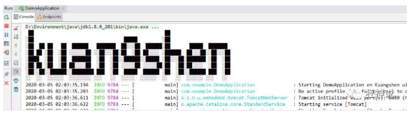

**SpringBoot这么简单的东西背后一定有故事，我们之后去进行一波源码分析！**


## 运行原理探究


我们之前写的HelloSpringBoot，到底是怎么运行的呢，Maven项目，我们一般从pom.xml文件探究起：

> **pom.xml**

### 父依赖

其中它主要是依赖一个父项目，主要是管理项目的资源过滤及插件！

```xml
<parent>
    <groupId>org.springframework.boot</groupId>
    <artifactId>spring-boot-starter-parent</artifactId>
    <version>2.2.5.RELEASE</version>
    <relativePath/> <!-- lookup parent from repository -->
</parent>
```

点进去，发现还有一个父依赖

```xml
<parent>
    <groupId>org.springframework.boot</groupId>
    <artifactId>spring-boot-dependencies</artifactId>
    <version>2.2.5.RELEASE</version>
    <relativePath>../../spring-boot-dependencies</relativePath>
</parent>
```

这里才是真正管理SpringBoot应用里面所有依赖版本的地方，SpringBoot的版本控制中心；

**以后我们导入依赖默认是不需要写版本；但是如果导入的包没有在依赖中管理着就需要手动配置版本了；**


### 启动器 spring-boot-starter

```xml
<dependency>
    <groupId>org.springframework.boot</groupId>
    <artifactId>spring-boot-starter-web</artifactId>
</dependency>
```

**springboot-boot-starter-xxx**：就是spring-boot的场景启动器

**spring-boot-starter-web**：帮我们导入了web模块正常运行所依赖的组件；

SpringBoot将所有的功能场景都抽取出来，做成一个个的starter （启动器），只需要在项目中引入这些starter即可，所有相关的依赖都会导入进来 ， 我们要用什么功能就导入什么样的场景启动器即可 ；我们未来也可以自己自定义 starter；


> **主启动类**

分析完了 pom.xml 来看看这个启动类


### 默认的主启动类

```java
//@SpringBootApplication 来标注一个主程序类
//说明这是一个Spring Boot应用
@SpringBootApplication
public class SpringbootApplication {

   public static void main(String[] args) {
     //以为是启动了一个方法，没想到启动了一个服务
      SpringApplication.run(SpringbootApplication.class, args);
   }

}
```

但是**一个简单的启动类并不简单！**我们来分析一下这些注解都干了什么


### @SpringBootApplication

作用：标注在某个类上说明这个类是SpringBoot的主配置类 ， SpringBoot就应该运行这个类的main方法来启动SpringBoot应用；

进入这个注解：可以看到上面还有很多其他注解！

```java
@SpringBootConfiguration
@EnableAutoConfiguration
@ComponentScan(
    excludeFilters = {@Filter(
    type = FilterType.CUSTOM,
    classes = {TypeExcludeFilter.class}
), @Filter(
    type = FilterType.CUSTOM,
    classes = {AutoConfigurationExcludeFilter.class}
)}
)
public @interface SpringBootApplication {
    // ......
}
```


### @ComponentScan

这个注解在Spring中很重要 ,它对应XML配置中的元素。

作用：自动扫描并加载符合条件的组件或者bean ， 将这个bean定义加载到IOC容器中


### @SpringBootConfiguration

作用：SpringBoot的配置类 ，标注在某个类上 ， 表示这是一个SpringBoot的配置类；

我们继续进去这个注解查看

```java
@Configuration
public @interface SpringBootConfiguration {}

@Component
public @interface Configuration {}
```

这里的 @Configuration，说明这是一个配置类 ，配置类就是对应Spring的xml 配置文件；

里面的 @Component 这就说明，启动类本身也是Spring中的一个组件而已，负责启动应用！

我们回到 SpringBootApplication 注解中继续看。


### @EnableAutoConfiguration

#### **@EnableAutoConfiguration ：开启自动配置功能**

以前我们需要自己配置的东西，而现在SpringBoot可以自动帮我们配置 ；@EnableAutoConfiguration告诉SpringBoot开启自动配置功能，这样自动配置才能生效；

点进注解接续查看：

#### **@AutoConfigurationPackage ：自动配置包**

```java
@Import({Registrar.class})
public @interface AutoConfigurationPackage {
}
```

#### **@import** ：Spring底层注解@import ， 给容器中导入一个组件

Registrar.class 作用：将主启动类的所在包及包下面所有子包里面的所有组件扫描到Spring容器 ；

这个分析完了，退到上一步，继续看

### **@Import(AutoConfigurationImportSelector.class)：给容器导入组件 ；**

AutoConfigurationImportSelector ：自动配置导入选择器，那么它会导入哪些组件的选择器呢？我们点击去这个类看源码：

1、这个类中有一个这样的方法

```java
// 获得候选的配置
protected List<String> getCandidateConfigurations(AnnotationMetadata metadata, AnnotationAttributes attributes) {
    //这里的getSpringFactoriesLoaderFactoryClass（）方法
    //返回的就是我们最开始看的启动自动导入配置文件的注解类；EnableAutoConfiguration
    List<String> configurations = SpringFactoriesLoader.loadFactoryNames(this.getSpringFactoriesLoaderFactoryClass(), this.getBeanClassLoader());
    Assert.notEmpty(configurations, "No auto configuration classes found in META-INF/spring.factories. If you are using a custom packaging, make sure that file is correct.");
    return configurations;
}
```

2、这个方法又调用了  SpringFactoriesLoader 类的静态方法！我们进入SpringFactoriesLoader类loadFactoryNames() 方法

```java

public static List<String> loadFactoryNames(Class<?> factoryClass, @Nullable ClassLoader classLoader) {
    String factoryClassName = factoryClass.getName();
    //这里它又调用了 loadSpringFactories 方法
    return (List)loadSpringFactories(classLoader).getOrDefault(factoryClassName, Collections.emptyList());
}
```

3、我们继续点击查看 loadSpringFactories 方法

```java
private static Map<String, List<String>> loadSpringFactories(@Nullable ClassLoader classLoader) {
    //获得classLoader ， 我们返回可以看到这里得到的就是EnableAutoConfiguration标注的类本身
    MultiValueMap<String, String> result = (MultiValueMap)cache.get(classLoader);
    if (result != null) {
        return result;
    } else {
        try {
            //去获取一个资源 "META-INF/spring.factories"
            Enumeration<URL> urls = classLoader != null ? classLoader.getResources("META-INF/spring.factories") : ClassLoader.getSystemResources("META-INF/spring.factories");
            LinkedMultiValueMap result = new LinkedMultiValueMap();

            //将读取到的资源遍历，封装成为一个Properties
            while(urls.hasMoreElements()) {
                URL url = (URL)urls.nextElement();
                UrlResource resource = new UrlResource(url);
                Properties properties = PropertiesLoaderUtils.loadProperties(resource);
                Iterator var6 = properties.entrySet().iterator();

                while(var6.hasNext()) {
                    Entry<?, ?> entry = (Entry)var6.next();
                    String factoryClassName = ((String)entry.getKey()).trim();
                    String[] var9 = StringUtils.commaDelimitedListToStringArray((String)entry.getValue());
                    int var10 = var9.length;

                    for(int var11 = 0; var11 < var10; ++var11) {
                        String factoryName = var9[var11];
                        result.add(factoryClassName, factoryName.trim());
                    }
                }
            }

            cache.put(classLoader, result);
            return result;
        } catch (IOException var13) {
            throw new IllegalArgumentException("Unable to load factories from location [META-INF/spring.factories]", var13);
        }
    }
}
```

4、发现一个多次出现的文件：spring.factories，全局搜索它


### spring.factories

我们根据源头打开spring.factories ， 看到了很多自动配置的文件；这就是自动配置根源所在！

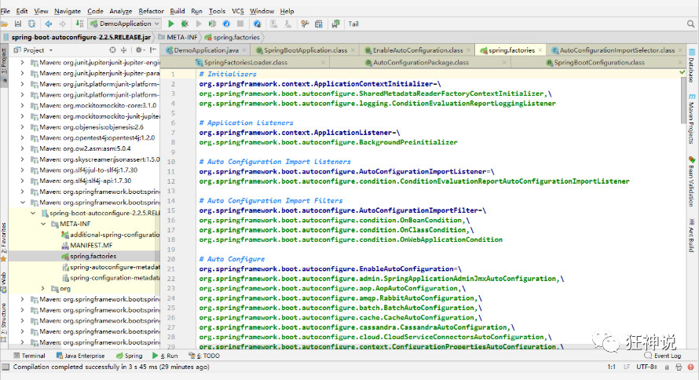

#### **WebMvcAutoConfiguration**

我们在上面的自动配置类随便找一个打开看看，比如 ：WebMvcAutoConfiguration

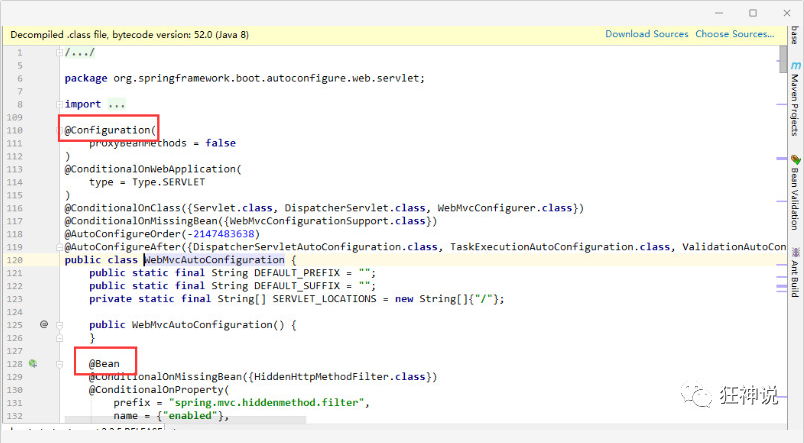

可以看到这些一个个的都是JavaConfig配置类，而且都注入了一些Bean，可以找一些自己认识的类，看着熟悉一下！

所以，自动配置真正实现是从classpath中搜寻所有的META-INF/spring.factories配置文件 ，并将其中对应的 org.springframework.boot.autoconfigure. 包下的配置项，通过反射实例化为对应标注了 @Configuration的JavaConfig形式的IOC容器配置类 ， 然后将这些都汇总成为一个实例并加载到IOC容器中。

### **结论：**

1. SpringBoot在启动的时候从类路径下的META-INF/spring.factories中获取EnableAutoConfiguration指定的值
2. 将这些值作为自动配置类导入容器 ， 自动配置类就生效 ， 帮我们进行自动配置工作；
3. 整个J2EE的整体解决方案和自动配置都在springboot-autoconfigure的jar包中；
4. 它会给容器中导入非常多的自动配置类 （xxxAutoConfiguration）, 就是给容器中导入这个场景需要的所有组件 ， 并配置好这些组件 ；
5. 有了自动配置类 ， 免去了我们手动编写配置注入功能组件等的工作；

**现在大家应该大概的了解了下，SpringBoot的运行原理，后面我们还会深化一次！**


> **SpringApplication**


### 不简单的方法

我最初以为就是运行了一个main方法，没想到却开启了一个服务；

```java
@SpringBootApplication
public class SpringbootApplication {
    public static void main(String[] args) {
        SpringApplication.run(SpringbootApplication.class, args);
    }
}
```

### **SpringApplication.run分析**

分析该方法主要分两部分，一部分是SpringApplication的实例化，二是run方法的执行；

### SpringApplication

**这个类主要做了以下四件事情：**

1、推断应用的类型是普通的项目还是Web项目

2、查找并加载所有可用初始化器 ， 设置到initializers属性中

3、找出所有的应用程序监听器，设置到listeners属性中

4、推断并设置main方法的定义类，找到运行的主类

查看构造器：

```java
public SpringApplication(ResourceLoader resourceLoader, Class... primarySources) {
    // ......
    this.webApplicationType = WebApplicationType.deduceFromClasspath();
    this.setInitializers(this.getSpringFactoriesInstances();
    this.setListeners(this.getSpringFactoriesInstances(ApplicationListener.class));
    this.mainApplicationClass = this.deduceMainApplicationClass();
}
```


## run方法流程分析

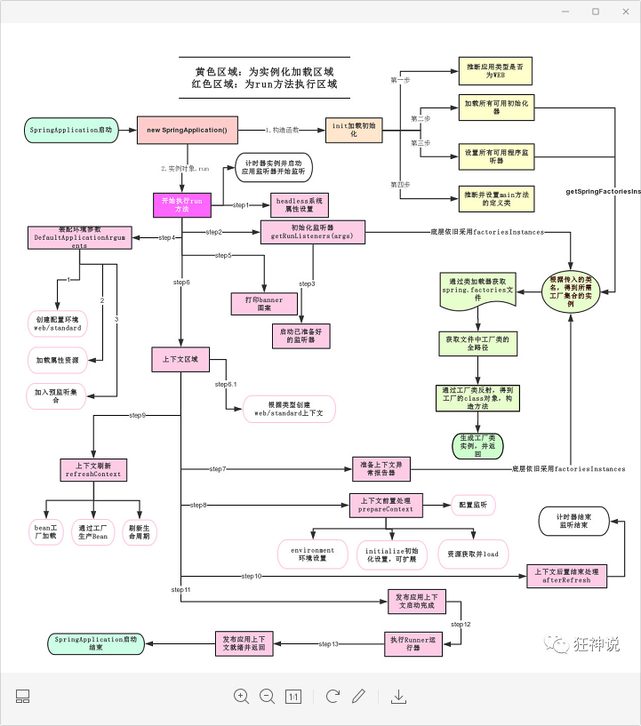

跟着源码和这幅图就可以一探究竟了！


## yaml语法学习


### 配置文件

SpringBoot使用一个全局的配置文件 ， 配置文件名称是固定的

- application.properties

- - 语法结构 ：key=value

- application.yml

- - 语法结构 ：key：空格 value

**配置文件的作用 ：**修改SpringBoot自动配置的默认值，因为SpringBoot在底层都给我们自动配置好了；

比如我们可以在配置文件中修改Tomcat 默认启动的端口号！测试一下！

```properties
server.port=8081
```

### yaml概述

YAML是 "YAML Ain't a Markup Language" （YAML不是一种标记语言）的递归缩写。在开发的这种语言时，YAML 的意思其实是："Yet Another Markup Language"（仍是一种标记语言）

**这种语言以数据作为中心，而不是以标记语言为重点！**

以前的配置文件，大多数都是使用xml来配置；比如一个简单的端口配置，我们来对比下yaml和xml

传统xml配置：

```xml
<server>
    <port>8081<port>
</server>
```

yaml配置：

```yaml
server：
  prot: 8080
```


### yaml基础语法

说明：语法要求严格！

1、空格不能省略

2、以缩进来控制层级关系，只要是左边对齐的一列数据都是同一个层级的。

3、属性和值的大小写都是十分敏感的。


**字面量：普通的值  [ 数字，布尔值，字符串  ]**

字面量直接写在后面就可以 ， 字符串默认不用加上双引号或者单引号；

```yaml
k: v
```

注意：

- “ ” 双引号，不会转义字符串里面的特殊字符 ， 特殊字符会作为本身想表示的意思；

  比如 ：name: "kuang \n shen"  输出 ：kuang  换行  shen

- '' 单引号，会转义特殊字符 ， 特殊字符最终会变成和普通字符一样输出

  比如 ：name: ‘kuang \n shen’  输出 ：kuang  \n  shen

  以上描述没有写错，\n本身的意思就是换行，转义之后才代表字符**\n**


**对象、Map（键值对）**

```yaml
#对象、Map格式
k: 
    v1:
    v2:
```

在下一行来写对象的属性和值得关系，注意缩进；比如：

```yaml
student:
    name: qinjiang
    age: 3
```

行内写法

```yaml
student: {name: qinjiang,age: 3}
```


**数组（ List、set ）**

用 - 值表示数组中的一个元素,比如：

```yaml
pets:
 - cat
 - dog
 - pig
```

行内写法

```yaml
pets: [cat,dog,pig]
```

**修改SpringBoot的默认端口号**

配置文件中添加，端口号的参数，就可以切换端口；

```yaml
server:
  port: 8082
```


## 注入配置文件

yaml文件更强大的地方在于，他可以给我们的实体类直接注入匹配值！

### yaml注入配置文件

1、在springboot项目中的resources目录下新建一个文件 application.yml

2、编写一个实体类 Dog；

```java
package com.kuang.springboot.pojo;

@Component  //注册bean到容器中
public class Dog {
    private String name;
    private Integer age;
    
    //有参无参构造、get、set方法、toString()方法  
}
```

3、思考，我们原来是如何给bean注入属性值的！@Value，给狗狗类测试一下：

```java
@Component //注册bean
public class Dog {
    @Value("阿黄")
    private String name;
    @Value("18")
    private Integer age;
}
```

4、在SpringBoot的测试类下注入狗狗输出一下；

```java
@SpringBootTest
class DemoApplicationTests {

    @Autowired //将狗狗自动注入进来
    Dog dog;

    @Test
    public void contextLoads() {
        System.out.println(dog); //打印看下狗狗对象
    }

}
```

结果成功输出，@Value注入成功，这是我们原来的办法对吧。

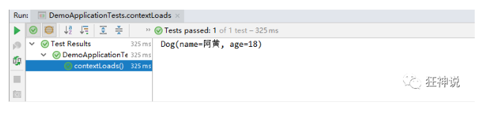

5、我们在编写一个复杂一点的实体类：Person 类

```java
@Component //注册bean到容器中
public class Person {
    private String name;
    private Integer age;
    private Boolean happy;
    private Date birth;
    private Map<String,Object> maps;
    private List<Object> lists;
    private Dog dog;
    
    //有参无参构造、get、set方法、toString()方法  
}
```

6、我们来使用yaml配置的方式进行注入，大家写的时候注意区别和优势，我们编写一个yaml配置！

```yaml
person:
  name: qinjiang
  age: 3
  happy: false
  birth: 2000/01/01
  maps: {k1: v1,k2: v2}
  lists:
   - code
   - girl
   - music
  dog:
    name: 旺财
    age: 1
```

7、我们刚才已经把person这个对象的所有值都写好了，我们现在来注入到我们的类中！

```java
/*
@ConfigurationProperties作用：
将配置文件中配置的每一个属性的值，映射到这个组件中；
告诉SpringBoot将本类中的所有属性和配置文件中相关的配置进行绑定
参数 prefix = “person” : 将配置文件中的person下面的所有属性一一对应
*/
@Component //注册bean
@ConfigurationProperties(prefix = "person")
public class Person {
    private String name;
    private Integer age;
    private Boolean happy;
    private Date birth;
    private Map<String,Object> maps;
    private List<Object> lists;
    private Dog dog;
}
```

8、IDEA 提示，springboot配置注解处理器没有找到，让我们看文档，我们可以查看文档，找到一个依赖！

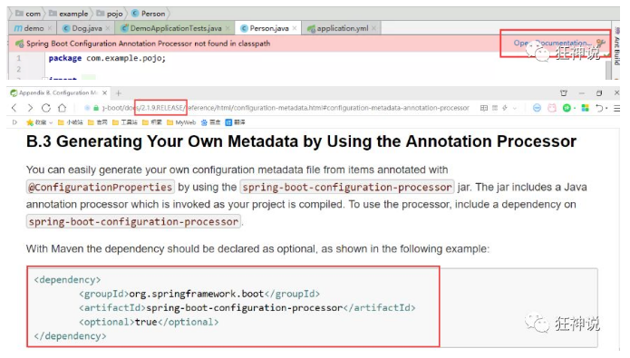

```xml
<!-- 导入配置文件处理器，配置文件进行绑定就会有提示，需要重启 -->
<dependency>
  <groupId>org.springframework.boot</groupId>
  <artifactId>spring-boot-configuration-processor</artifactId>
  <optional>true</optional>
</dependency>
```

9、确认以上配置都OK之后，我们去测试类中测试一下：

```java
@SpringBootTest
class DemoApplicationTests {

    @Autowired
    Person person; //将person自动注入进来

    @Test
    public void contextLoads() {
        System.out.println(person); //打印person信息
    }

}
```

结果：所有值全部注入成功！

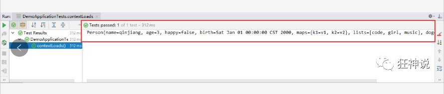

**yaml配置注入到实体类完全OK！**

课堂测试：

1、将配置文件的key 值 和 属性的值设置为不一样，则结果输出为null，注入失败

2、在配置一个person2，然后将 @ConfigurationProperties(prefix = "person2") 指向我们的person2；


### 加载指定的配置文件

**@PropertySource ：**加载指定的配置文件；

**@configurationProperties**：默认从全局配置文件中获取值；

1、我们去在resources目录下新建一个**person.properties**文件

```properties
name=kuangshen
```

2、然后在我们的代码中指定加载person.properties文件

```java
@PropertySource(value = "classpath:person.properties")
@Component //注册bean
public class Person {

    @Value("${name}")
    private String name;

    ......  
}
```

3、再次输出测试一下：指定配置文件绑定成功！

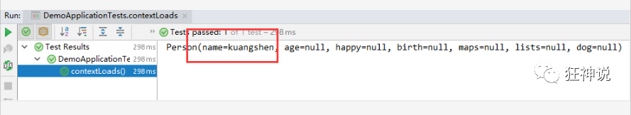


### 配置文件占位符

配置文件还可以编写占位符生成随机数

```yaml
person:
    name: qinjiang${random.uuid} # 随机uuid
    age: ${random.int}  # 随机int
    happy: false
    birth: 2000/01/01
    maps: {k1: v1,k2: v2}
    lists:
      - code
      - girl
      - music
    dog:
      name: ${person.hello:other}_旺财
      age: 1
```


### 回顾properties配置

我们上面采用的yaml方法都是最简单的方式，开发中最常用的；也是springboot所推荐的！那我们来唠唠其他的实现方式，道理都是相同的；写还是那样写；配置文件除了yml还有我们之前常用的properties ， 我们没有讲，我们来唠唠！

【注意】properties配置文件在写中文的时候，会有乱码 ， 我们需要去IDEA中设置编码格式为UTF-8；

settings-->FileEncodings 中配置；

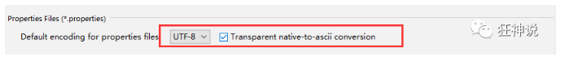

**测试步骤：**

1、新建一个实体类User

```java
@Component //注册bean
public class User {
    private String name;
    private int age;
    private String sex;
}
```

2、编辑配置文件 user.properties

```properties
user1.name=kuangshen
user1.age=18
user1.sex=男
```

3、我们在User类上使用@Value来进行注入！

```java
@Component //注册bean
@PropertySource(value = "classpath:user.properties")
public class User {
    //直接使用@value
    @Value("${user.name}") //从配置文件中取值
    private String name;
    @Value("#{9*2}")  // #{SPEL} Spring表达式
    private int age;
    @Value("男")  // 字面量
    private String sex;
}
```

4、Springboot测试

```jade
@SpringBootTest
class DemoApplicationTests {

    @Autowired
    User user;

    @Test
    public void contextLoads() {
        System.out.println(user);
    }

}
```

结果正常输出：

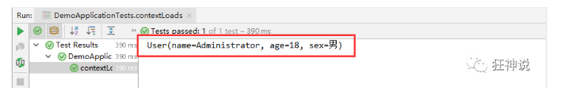


### 对比小结

@Value这个使用起来并不友好！我们需要为每个属性单独注解赋值，比较麻烦；我们来看个功能对比图

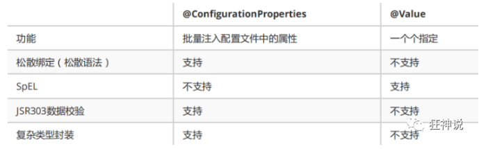

1、@ConfigurationProperties只需要写一次即可 ， @Value则需要每个字段都添加

2、松散绑定：这个什么意思呢? 比如我的yml中写的last-name，这个和lastName是一样的， - 后面跟着的字母默认是大写的。这就是松散绑定。可以测试一下

3、JSR303数据校验 ， 这个就是我们可以在字段是增加一层过滤器验证 ， 可以保证数据的合法性

4、复杂类型封装，yml中可以封装对象 ， 使用value就不支持

**结论：**

配置yml和配置properties都可以获取到值 ， 强烈推荐 yml；

如果我们在某个业务中，只需要获取配置文件中的某个值，可以使用一下 @value；

如果说，我们专门编写了一个JavaBean来和配置文件进行一一映射，就直接@configurationProperties，不要犹豫！


## JSR303数据校验


### 先看看如何使用

Springboot中可以用@validated来校验数据，如果数据异常则会统一抛出异常，方便异常中心统一处理。我们这里来写个注解让我们的name只能支持Email格式；

```java
@Component //注册bean
@ConfigurationProperties(prefix = "person")
@Validated  //数据校验
public class Person {

    @Email(message="邮箱格式错误") //name必须是邮箱格式
    private String name;
}
```

运行结果 ：default message [不是一个合法的电子邮件地址];

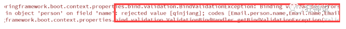

**使用数据校验，可以保证数据的正确性；** 


@Email爆红：

添加依赖：

~~~xml
<dependency>
	<groupId>org.springframework.boot</groupId>
	<artifactId>spring-boot-starter-validation</artifactId>
</dependency>
~~~


### 常见参数

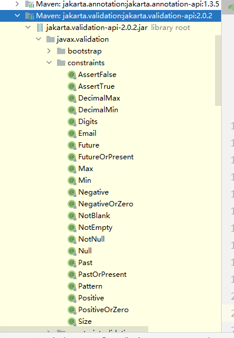

```java
@NotNull(message="名字不能为空")
private String userName;
@Max(value=120,message="年龄最大不能查过120")
private int age;
@Email(message="邮箱格式错误")
private String email;

空检查
@Null       验证对象是否为null
@NotNull    验证对象是否不为null, 无法查检长度为0的字符串
@NotBlank   检查约束字符串是不是Null还有被Trim的长度是否大于0,只对字符串,且会去掉前后空格.
@NotEmpty   检查约束元素是否为NULL或者是EMPTY.
    
Booelan检查
@AssertTrue     验证 Boolean 对象是否为 true  
@AssertFalse    验证 Boolean 对象是否为 false  
    
长度检查
@Size(min=, max=) 验证对象（Array,Collection,Map,String）长度是否在给定的范围之内  
@Length(min=, max=) string is between min and max included.

日期检查
@Past       验证 Date 和 Calendar 对象是否在当前时间之前  
@Future     验证 Date 和 Calendar 对象是否在当前时间之后  
@Pattern    验证 String 对象是否符合正则表达式的规则

.......等等
除此以外，我们还可以自定义一些数据校验规则
```


## 多环境切换

profile是Spring对不同环境提供不同配置功能的支持，可以通过激活不同的环境版本，实现快速切换环境；

### 多配置文件

我们在主配置文件编写的时候，文件名可以是 application-{profile}.properties/yml , 用来指定多个环境版本；

**例如：**

application-test.properties 代表测试环境配置

application-dev.properties 代表开发环境配置

但是Springboot并不会直接启动这些配置文件，它**默认使用application.properties主配置文件**；

我们需要通过一个配置来选择需要激活的环境：

```properties
#比如在配置文件中指定使用dev环境，我们可以通过设置不同的端口号进行测试；
#我们启动SpringBoot，就可以看到已经切换到dev下的配置了；
spring.profiles.active=dev
```


### yaml的多文档块

和properties配置文件中一样，但是使用yml去实现不需要创建多个配置文件，更加方便了 !

```yaml
server:
  port: 8081
#选择要激活那个环境块
spring:
  profiles:
    active: prod

---
server:
  port: 8083
spring:
  profiles: dev #配置环境的名称


---

server:
  port: 8084
spring:
  profiles: prod  #配置环境的名称
```

**注意：如果yml和properties同时都配置了端口，并且没有激活其他环境 ， 默认会使用properties配置文件的！**


### 配置文件加载位置

**外部加载配置文件的方式十分多，我们选择最常用的即可，在开发的资源文件中进行配置！**

官方外部配置文件说明参考文档

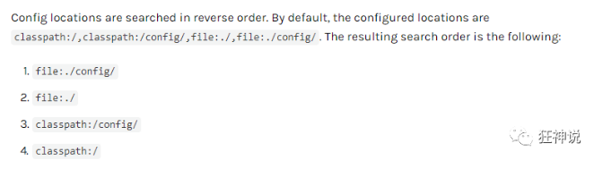

springboot 启动会扫描以下位置的application.properties或者application.yml文件作为Spring boot的默认配置文件：

```
优先级1：项目路径下的config文件夹配置文件
优先级2：项目路径下配置文件
优先级3：资源路径下的config文件夹配置文件
优先级4：资源路径下配置文件
```

优先级由高到底，高优先级的配置会覆盖低优先级的配置；

**SpringBoot会从这四个位置全部加载主配置文件；互补配置；**

我们在最低级的配置文件中设置一个项目访问路径的配置来测试互补问题；

```properties
#配置项目的访问路径
server.servlet.context-path=/kuang
```


### 拓展，运维小技巧

指定位置加载配置文件

我们还可以通过spring.config.location来改变默认的配置文件位置

项目打包好以后，我们可以使用命令行参数的形式，启动项目的时候来指定配置文件的新位置；这种情况，一般是后期运维做的多，**相同配置，外部指定的配置文件优先级最高**

```shell
java -jar spring-boot-config.jar --spring.config.location=F:/application.properties
```


## 自动配置原理


配置文件到底能写什么？怎么写？

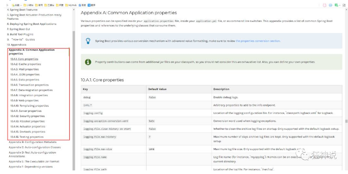


### 分析自动配置原理

我们以**HttpEncodingAutoConfiguration（Http编码自动配置）**为例解释自动配置原理；

```java
//表示这是一个配置类，和以前编写的配置文件一样，也可以给容器中添加组件；
@Configuration 

//启动指定类的ConfigurationProperties功能；
  //进入这个HttpProperties查看，将配置文件中对应的值和HttpProperties绑定起来；
  //并把HttpProperties加入到ioc容器中
@EnableConfigurationProperties({HttpProperties.class}) 

//Spring底层@Conditional注解
  //根据不同的条件判断，如果满足指定的条件，整个配置类里面的配置就会生效；
  //这里的意思就是判断当前应用是否是web应用，如果是，当前配置类生效
@ConditionalOnWebApplication(
    type = Type.SERVLET
)

//判断当前项目有没有这个类CharacterEncodingFilter；SpringMVC中进行乱码解决的过滤器；
@ConditionalOnClass({CharacterEncodingFilter.class})

//判断配置文件中是否存在某个配置：spring.http.encoding.enabled；
  //如果不存在，判断也是成立的
  //即使我们配置文件中不配置pring.http.encoding.enabled=true，也是默认生效的；
@ConditionalOnProperty(
    prefix = "spring.http.encoding",
    value = {"enabled"},
    matchIfMissing = true
)

public class HttpEncodingAutoConfiguration {
    //他已经和SpringBoot的配置文件映射了
    private final Encoding properties;
    //只有一个有参构造器的情况下，参数的值就会从容器中拿
    public HttpEncodingAutoConfiguration(HttpProperties properties) {
        this.properties = properties.getEncoding();
    }
    
    //给容器中添加一个组件，这个组件的某些值需要从properties中获取
    @Bean
    @ConditionalOnMissingBean //判断容器没有这个组件？
    public CharacterEncodingFilter characterEncodingFilter() {
        CharacterEncodingFilter filter = new OrderedCharacterEncodingFilter();
        filter.setEncoding(this.properties.getCharset().name());
        filter.setForceRequestEncoding(this.properties.shouldForce(org.springframework.boot.autoconfigure.http.HttpProperties.Encoding.Type.REQUEST));
        filter.setForceResponseEncoding(this.properties.shouldForce(org.springframework.boot.autoconfigure.http.HttpProperties.Encoding.Type.RESPONSE));
        return filter;
    }
    //。。。。。。。
}
```

**一句话总结 ：根据当前不同的条件判断，决定这个配置类是否生效！**

- 一但这个配置类生效；这个配置类就会给容器中添加各种组件；
- 这些组件的属性是从对应的properties类中获取的，这些类里面的每一个属性又是和配置文件绑定的；
- 所有在配置文件中能配置的属性都是在xxxxProperties类中封装着；
- 配置文件能配置什么就可以参照某个功能对应的这个属性类

```java
//从配置文件中获取指定的值和bean的属性进行绑定
@ConfigurationProperties(prefix = "spring.http") 
public class HttpProperties {
    // .....
}
```

我们去配置文件里面试试前缀，看提示！

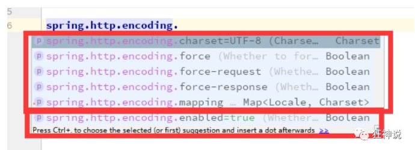

**这就是自动装配的原理！**


### 精髓

1、SpringBoot启动会加载大量的自动配置类

2、我们看我们需要的功能有没有在SpringBoot默认写好的自动配置类当中；

3、我们再来看这个自动配置类中到底配置了哪些组件；（只要我们要用的组件存在在其中，我们就不需要再手动配置了）

4、给容器中自动配置类添加组件的时候，会从properties类中获取某些属性。我们只需要在配置文件中指定这些属性的值即可；

**xxxxAutoConfigurartion：自动配置类；**给容器中添加组件

**xxxxProperties:封装配置文件中相关属性；**

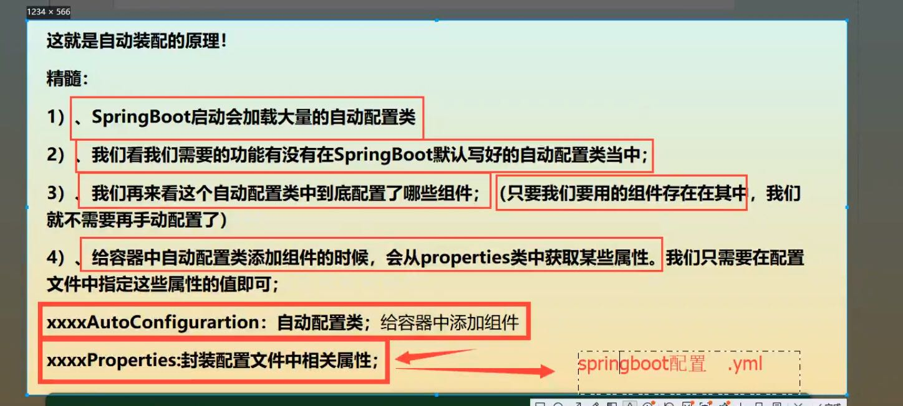

### 了解：@Conditional

了解完自动装配的原理后，我们来关注一个细节问题，**自动配置类必须在一定的条件下才能生效；**

**@Conditional派生注解（Spring注解版原生的@Conditional作用）**

作用：必须是@Conditional指定的条件成立，才给容器中添加组件，配置配里面的所有内容才生效；

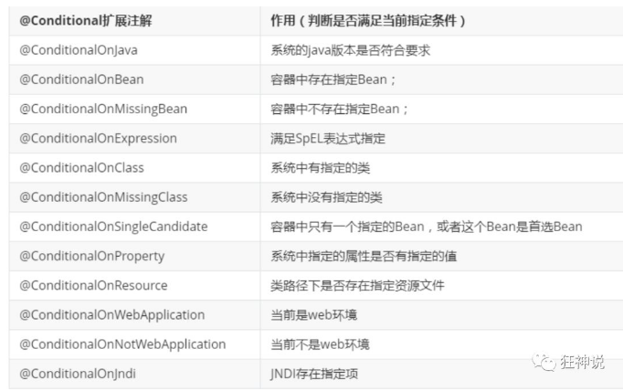

**那么多的自动配置类，必须在一定的条件下才能生效；也就是说，我们加载了这么多的配置类，但不是所有的都生效了。**

我们怎么知道哪些自动配置类生效？

**我们可以通过启用 debug=true属性；来让控制台打印自动配置报告，这样我们就可以很方便的知道哪些自动配置类生效；**

```properties
#开启springboot的调试类
debug=true
```

**Positive matches:（自动配置类启用的：正匹配）**

**Negative matches:（没有启动，没有匹配成功的自动配置类：负匹配）**

**Unconditional classes: （没有条件的类）**

【演示：查看输出的日志】

掌握吸收理解原理，即可以不变应万变！


## Web开发探究


### 简介

好的，同学们，那么接下来呢，我们开始学习SpringBoot与Web开发，从这一章往后，就属于我们实战部分的内容了；

其实SpringBoot的东西用起来非常简单，因为SpringBoot最大的特点就是自动装配。

**使用SpringBoot的步骤：**

1、创建一个SpringBoot应用，选择我们需要的模块，SpringBoot就会默认将我们的需要的模块自动配置好

2、手动在配置文件中配置部分配置项目就可以运行起来了

3、专注编写业务代码，不需要考虑以前那样一大堆的配置了。

要熟悉掌握开发，之前学习的自动配置的原理一定要搞明白！

比如SpringBoot到底帮我们配置了什么？我们能不能修改？我们能修改哪些配置？我们能不能扩展？

- 向容器中自动配置组件 ：*** Autoconfiguration
- 自动配置类，封装配置文件的内容：***Properties

没事就找找类，看看自动装配原理！

我们之后来进行一个单体项目的小项目测试，让大家能够快速上手开发！

## 静态资源处理


### 静态资源映射规则

**首先，我们搭建一个普通的SpringBoot项目，回顾一下HelloWorld程序！**

写请求非常简单，那我们要引入我们前端资源，我们项目中有许多的静态资源，比如css，js等文件，这个SpringBoot怎么处理呢？

如果我们是一个web应用，我们的main下会有一个webapp，我们以前都是将所有的页面导在这里面的，对吧！但是我们现在的pom呢，打包方式是为jar的方式，那么这种方式SpringBoot能不能来给我们写页面呢？当然是可以的，但是SpringBoot对于静态资源放置的位置，是有规定的！

**我们先来聊聊这个静态资源映射规则：**

SpringBoot中，SpringMVC的web配置都在 WebMvcAutoConfiguration 这个配置类里面；

我们可以去看看 WebMvcAutoConfigurationAdapter 中有很多配置方法；

有一个方法：addResourceHandlers 添加资源处理

```java
@Override
public void addResourceHandlers(ResourceHandlerRegistry registry) {
    if (!this.resourceProperties.isAddMappings()) {
        // 已禁用默认资源处理
        logger.debug("Default resource handling disabled");
        return;
    }
    // 缓存控制
    Duration cachePeriod = this.resourceProperties.getCache().getPeriod();
    CacheControl cacheControl = this.resourceProperties.getCache().getCachecontrol().toHttpCacheControl();
    // webjars 配置
    if (!registry.hasMappingForPattern("/webjars/**")) {
        customizeResourceHandlerRegistration(registry.addResourceHandler("/webjars/**")
                                             .addResourceLocations("classpath:/META-INF/resources/webjars/")
                                             .setCachePeriod(getSeconds(cachePeriod)).setCacheControl(cacheControl));
    }
    // 静态资源配置
    String staticPathPattern = this.mvcProperties.getStaticPathPattern();
    if (!registry.hasMappingForPattern(staticPathPattern)) {
        customizeResourceHandlerRegistration(registry.addResourceHandler(staticPathPattern)
                                             .addResourceLocations(getResourceLocations(this.resourceProperties.getStaticLocations()))
                                             .setCachePeriod(getSeconds(cachePeriod)).setCacheControl(cacheControl));
    }
}
```

读一下源代码：比如所有的 /webjars/** ， 都需要去 classpath:/META-INF/resources/webjars/ 找对应的资源；

### 什么是webjars 呢？

Webjars本质就是以jar包的方式引入我们的静态资源 ， 我们以前要导入一个静态资源文件，直接导入即可。

使用SpringBoot需要使用Webjars，我们可以去搜索一下：

网站：https://www.webjars.org 

要使用jQuery，我们只要要引入jQuery对应版本的pom依赖即可！

```xml
<dependency>
    <groupId>org.webjars</groupId>
    <artifactId>jquery</artifactId>
    <version>3.4.1</version>
</dependency>
```

导入完毕，查看webjars目录结构，并访问Jquery.js文件！

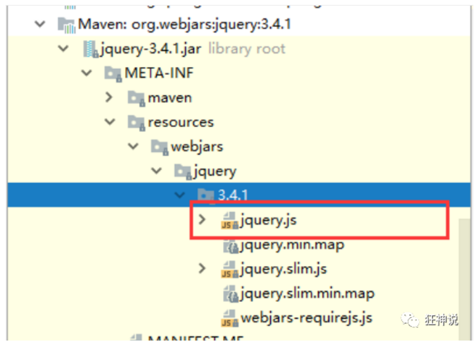

访问：只要是静态资源，SpringBoot就会去对应的路径寻找资源，我们这里访问：http://localhost:8080/webjars/jquery/3.4.1/jquery.js

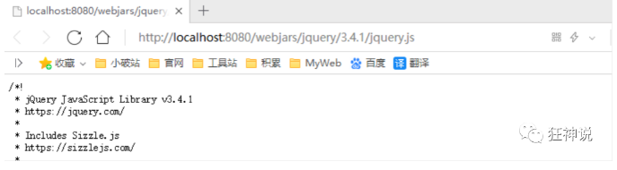

### 第二种静态资源映射规则

那我们项目中要是使用自己的静态资源该怎么导入呢？我们看下一行代码；

我们去找staticPathPattern发现第二种映射规则 ：/** , 访问当前的项目任意资源，它会去找 resourceProperties 这个类，我们可以点进去看一下分析：

```java
// 进入方法
public String[] getStaticLocations() {
    return this.staticLocations;
}
// 找到对应的值
private String[] staticLocations = CLASSPATH_RESOURCE_LOCATIONS;
// 找到路径
private static final String[] CLASSPATH_RESOURCE_LOCATIONS = { 
    "classpath:/META-INF/resources/",
  "classpath:/resources/", 
    "classpath:/static/", 
    "classpath:/public/" 
};
```

ResourceProperties 可以设置和我们静态资源有关的参数；这里面指向了它会去寻找资源的文件夹，即上面数组的内容。

优先级从上往下。

我们可以在resources根目录下新建对应的文件夹，都可以存放我们的静态文件；

比如我们访问 http://localhost:8080/1.js , 他就会去这些文件夹中寻找对应的静态资源文件；

### 自定义静态资源路径

我们也可以自己通过配置文件来指定一下，哪些文件夹是需要我们放静态资源文件的，在application.properties中配置；

- 

```properties
spring.mvc.static-path-pattern=classpath:/coding/,classpath:/kuang/
```

一旦自己定义了静态文件夹的路径，原来的自动配置就都会失效了！

## 首页处理

静态资源文件夹说完后，我们继续向下看源码！可以看到一个欢迎页的映射，就是我们的首页！

```java
@Bean
public WelcomePageHandlerMapping welcomePageHandlerMapping(ApplicationContext applicationContext,
                                                           FormattingConversionService mvcConversionService,
                                                           ResourceUrlProvider mvcResourceUrlProvider) {
    WelcomePageHandlerMapping welcomePageHandlerMapping = new WelcomePageHandlerMapping(
        new TemplateAvailabilityProviders(applicationContext), applicationContext, getWelcomePage(), // getWelcomePage 获得欢迎页
        this.mvcProperties.getStaticPathPattern());
    welcomePageHandlerMapping.setInterceptors(getInterceptors(mvcConversionService, mvcResourceUrlProvider));
    return welcomePageHandlerMapping;
}
```

点进去继续看

```java
private Optional<Resource> getWelcomePage() {
    String[] locations = getResourceLocations(this.resourceProperties.getStaticLocations());
    // ::是java8 中新引入的运算符
    // Class::function的时候function是属于Class的，应该是静态方法。
    // this::function的funtion是属于这个对象的。
    // 简而言之，就是一种语法糖而已，是一种简写
    return Arrays.stream(locations).map(this::getIndexHtml).filter(this::isReadable).findFirst();
}
// 欢迎页就是一个location下的的 index.html 而已
private Resource getIndexHtml(String location) {
    return this.resourceLoader.getResource(location + "index.html");
}
```

欢迎页，静态资源文件夹下的所有 index.html 页面；被 /** 映射。

比如我访问  http://localhost:8080/ ，就会找静态资源文件夹下的 index.html

新建一个 index.html ，在我们上面的3个目录中任意一个；然后访问测试  http://localhost:8080/  看结果！

**关于网站图标说明**：

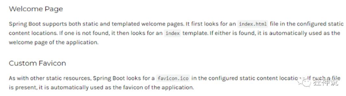

与其他静态资源一样，Spring Boot在配置的静态内容位置中查找 favicon.ico。如果存在这样的文件，它将自动用作应用程序的favicon。

1、关闭SpringBoot默认图标

```properties
#关闭默认图标
spring.mvc.favicon.enabled=false
```

2、自己放一个图标在静态资源目录下，我放在 public 目录下

3、清除浏览器缓存！刷新网页，发现图标已经变成自己的了！


## Thymeleaf


### 模板引擎

前端交给我们的页面，是html页面。如果是我们以前开发，我们需要把他们转成jsp页面，jsp好处就是当我们查出一些数据转发到JSP页面以后，我们可以用jsp轻松实现数据的显示，及交互等。

jsp支持非常强大的功能，包括能写Java代码，但是呢，我们现在的这种情况，SpringBoot这个项目首先是以jar的方式，不是war，像第二，我们用的还是嵌入式的Tomcat，所以呢，**他现在默认是不支持jsp的**。

那不支持jsp，如果我们直接用纯静态页面的方式，那给我们开发会带来非常大的麻烦，那怎么办呢？

**SpringBoot推荐你可以来使用模板引擎：**

模板引擎，我们其实大家听到很多，其实jsp就是一个模板引擎，还有用的比较多的freemarker，包括SpringBoot给我们推荐的Thymeleaf，模板引擎有非常多，但再多的模板引擎，他们的思想都是一样的，什么样一个思想呢我们来看一下这张图：

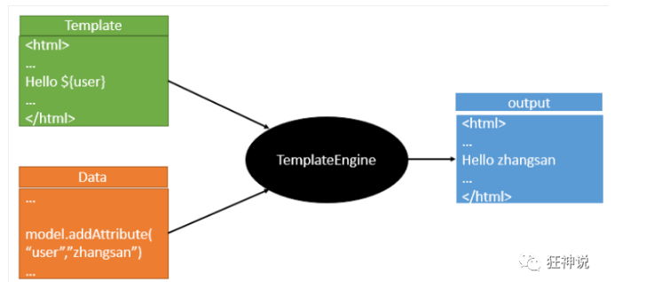

模板引擎的作用就是我们来写一个页面模板，比如有些值呢，是动态的，我们写一些表达式。而这些值，从哪来呢，就是我们在后台封装一些数据。然后把这个模板和这个数据交给我们模板引擎，模板引擎按照我们这个数据帮你把这表达式解析、填充到我们指定的位置，然后把这个数据最终生成一个我们想要的内容给我们写出去，这就是我们这个模板引擎，不管是jsp还是其他模板引擎，都是这个思想。只不过呢，就是说不同模板引擎之间，他们可能这个语法有点不一样。其他的我就不介绍了，我主要来介绍一下SpringBoot给我们推荐的Thymeleaf模板引擎，这模板引擎呢，是一个高级语言的模板引擎，他的这个语法更简单。而且呢，功能更强大。

我们呢，就来看一下这个模板引擎，那既然要看这个模板引擎。首先，我们来看SpringBoot里边怎么用。


### 引入Thymeleaf

怎么引入呢，对于springboot来说，什么事情不都是一个start的事情嘛，我们去在项目中引入一下。给大家三个网址：

Thymeleaf 官网：https://www.thymeleaf.org/

Thymeleaf 在Github 的主页：https://github.com/thymeleaf/thymeleaf

Spring官方文档：找到我们对应的版本

https://docs.spring.io/spring-boot/docs/2.2.5.RELEASE/reference/htmlsingle/#using-boot-starter 

找到对应的pom依赖：可以适当点进源码看下本来的包！

```xml
<!--thymeleaf-->
<dependency>
    <groupId>org.springframework.boot</groupId>
    <artifactId>spring-boot-starter-thymeleaf</artifactId>
</dependency>
```

Maven会自动下载jar包，我们可以去看下下载的东西；

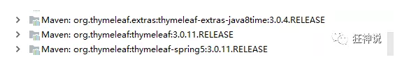


### Thymeleaf分析

前面呢，我们已经引入了Thymeleaf，那这个要怎么使用呢？

我们首先得按照SpringBoot的自动配置原理看一下我们这个Thymeleaf的自动配置规则，在按照那个规则，我们进行使用。

我们去找一下Thymeleaf的自动配置类：ThymeleafProperties

```java
@ConfigurationProperties(
    prefix = "spring.thymeleaf"
)
public class ThymeleafProperties {
    private static final Charset DEFAULT_ENCODING;
    public static final String DEFAULT_PREFIX = "classpath:/templates/";
    public static final String DEFAULT_SUFFIX = ".html";
    private boolean checkTemplate = true;
    private boolean checkTemplateLocation = true;
    private String prefix = "classpath:/templates/";
    private String suffix = ".html";
    private String mode = "HTML";
    private Charset encoding;
}
```

我们可以在其中看到默认的前缀和后缀！

我们只需要把我们的html页面放在类路径下的templates下，thymeleaf就可以帮我们自动渲染了。

使用thymeleaf什么都不需要配置，只需要将他放在指定的文件夹下即可！


**测试**

1、编写一个TestController

```java
@Controller
public class TestController {
    
    @RequestMapping("/t1")
    public String test1(){
        //classpath:/templates/test.html
        return "test";
    }
    
}
```

2、编写一个测试页面  test.html 放在 templates 目录下

```html
<!DOCTYPE html>
<html lang="en">
<head>
    <meta charset="UTF-8">
    <title>Title</title>
</head>
<body>
<h1>测试页面</h1>

</body>
</html>
```

3、启动项目请求测试


### Thymeleaf 语法学习

要学习语法，还是参考官网文档最为准确，我们找到对应的版本看一下；

Thymeleaf 官网：https://www.thymeleaf.org/ ， 简单看一下官网！我们去下载Thymeleaf的官方文档！

**我们做个最简单的练习 ：我们需要查出一些数据，在页面中展示**

1、修改测试请求，增加数据传输；

```java
@RequestMapping("/t1")
public String test1(Model model){
    //存入数据
    model.addAttribute("msg","Hello,Thymeleaf");
    //classpath:/templates/test.html
    return "test";
}
```

2、我们要使用thymeleaf，需要在html文件中导入命名空间的约束，方便提示。

我们可以去官方文档的#3中看一下命名空间拿来过来：

```html
 xmlns:th="http://www.thymeleaf.org"
```

3、我们去编写下前端页面

```html
<!DOCTYPE html>
<html lang="en" xmlns:th="http://www.thymeleaf.org">
<head>
    <meta charset="UTF-8">
    <title>狂神说</title>
</head>
<body>
<h1>测试页面</h1>

<!--th:text就是将div中的内容设置为它指定的值，和之前学习的Vue一样-->
<div th:text="${msg}"></div>
</body>
</html>
```

4、启动测试！

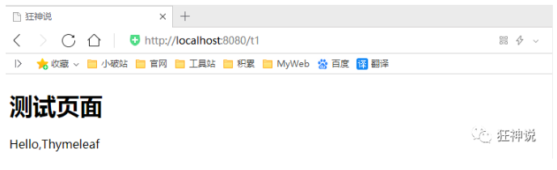


**OK，入门搞定，我们来认真研习一下Thymeleaf的使用语法！**

**1、我们可以使用任意的 th:attr 来替换Html中原生属性的值！**

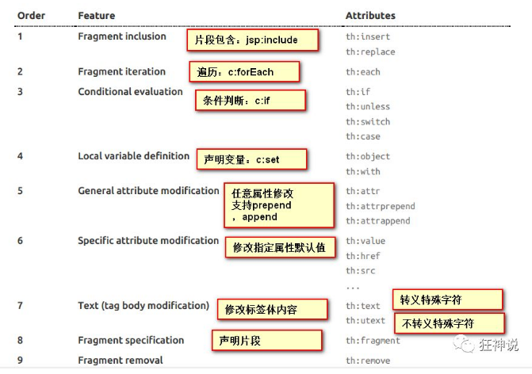

**2、我们能写哪些表达式呢？**

```yaml
Simple expressions:（表达式语法）
Variable Expressions: ${...}：获取变量值；OGNL；
    1）、获取对象的属性、调用方法
    2）、使用内置的基本对象：#18
         #ctx : the context object.
         #vars: the context variables.
         #locale : the context locale.
         #request : (only in Web Contexts) the HttpServletRequest object.
         #response : (only in Web Contexts) the HttpServletResponse object.
         #session : (only in Web Contexts) the HttpSession object.
         #servletContext : (only in Web Contexts) the ServletContext object.

    3）、内置的一些工具对象：
　　　　　　#execInfo : information about the template being processed.
　　　　　　#uris : methods for escaping parts of URLs/URIs
　　　　　　#conversions : methods for executing the configured conversion service (if any).
　　　　　　#dates : methods for java.util.Date objects: formatting, component extraction, etc.
　　　　　　#calendars : analogous to #dates , but for java.util.Calendar objects.
　　　　　　#numbers : methods for formatting numeric objects.
　　　　　　#strings : methods for String objects: contains, startsWith, prepending/appending, etc.
　　　　　　#objects : methods for objects in general.
　　　　　　#bools : methods for boolean evaluation.
　　　　　　#arrays : methods for arrays.
　　　　　　#lists : methods for lists.
　　　　　　#sets : methods for sets.
　　　　　　#maps : methods for maps.
　　　　　　#aggregates : methods for creating aggregates on arrays or collections.
==================================================================================

  Selection Variable Expressions: *{...}：选择表达式：和${}在功能上是一样；
  Message Expressions: #{...}：获取国际化内容
  Link URL Expressions: @{...}：定义URL；
  Fragment Expressions: ~{...}：片段引用表达式

Literals（字面量）
      Text literals: 'one text' , 'Another one!' ,…
      Number literals: 0 , 34 , 3.0 , 12.3 ,…
      Boolean literals: true , false
      Null literal: null
      Literal tokens: one , sometext , main ,…
      
Text operations:（文本操作）
    String concatenation: +
    Literal substitutions: |The name is ${name}|
    
Arithmetic operations:（数学运算）
    Binary operators: + , - , * , / , %
    Minus sign (unary operator): -
    
Boolean operations:（布尔运算）
    Binary operators: and , or
    Boolean negation (unary operator): ! , not
    
Comparisons and equality:（比较运算）
    Comparators: > , < , >= , <= ( gt , lt , ge , le )
    Equality operators: == , != ( eq , ne )
    
Conditional operators:条件运算（三元运算符）
    If-then: (if) ? (then)
    If-then-else: (if) ? (then) : (else)
    Default: (value) ?: (defaultvalue)
    
Special tokens:
    No-Operation: _
```


**练习测试：**

1、 我们编写一个Controller，放一些数据

```java
@RequestMapping("/t2")
public String test2(Map<String,Object> map){
    //存入数据
    map.put("msg","<h1>Hello</h1>");
    map.put("users", Arrays.asList("qinjiang","kuangshen"));
    //classpath:/templates/test.html
    return "test";
}
```

2、测试页面取出数据

```html
<!DOCTYPE html>
<html lang="en" xmlns:th="http://www.thymeleaf.org">
<head>
    <meta charset="UTF-8">
    <title>狂神说</title>
</head>
<body>
<h1>测试页面</h1>

<div th:text="${msg}"></div>
<!--不转义-->
<div th:utext="${msg}"></div>

<!--遍历数据-->
<!--th:each每次遍历都会生成当前这个标签：官网#9-->
<h4 th:each="user :${users}" th:text="${user}"></h4>

<h4>
    <!--行内写法：官网#12-->
    <span th:each="user:${users}">[[${user}]]</span>
</h4>

</body>
</html>
```


3、启动项目测试！

**我们看完语法，很多样式，我们即使现在学习了，也会忘记，所以我们在学习过程中，需要使用什么，根据官方文档来查询，才是最重要的，要熟练使用官方文档！**


## MVC自动配置原理


### 官网阅读

在进行项目编写前，我们还需要知道一个东西，就是SpringBoot对我们的SpringMVC还做了哪些配置，包括如何扩展，如何定制。

只有把这些都搞清楚了，我们在之后使用才会更加得心应手。途径一：源码分析，途径二：官方文档！

地址 ：https://docs.spring.io/spring-boot/docs/2.2.5.RELEASE/reference/htmlsingle/#boot-features-spring-mvc-auto-configuration

```java
Spring MVC Auto-configuration
// Spring Boot为Spring MVC提供了自动配置，它可以很好地与大多数应用程序一起工作。
Spring Boot provides auto-configuration for Spring MVC that works well with most applications.
// 自动配置在Spring默认设置的基础上添加了以下功能：
The auto-configuration adds the following features on top of Spring’s defaults:
// 包含视图解析器
Inclusion of ContentNegotiatingViewResolver and BeanNameViewResolver beans.
// 支持静态资源文件夹的路径，以及webjars
Support for serving static resources, including support for WebJars 
// 自动注册了Converter：
// 转换器，这就是我们网页提交数据到后台自动封装成为对象的东西，比如把"1"字符串自动转换为int类型
// Formatter：【格式化器，比如页面给我们了一个2019-8-10，它会给我们自动格式化为Date对象】
Automatic registration of Converter, GenericConverter, and Formatter beans.
// HttpMessageConverters
// SpringMVC用来转换Http请求和响应的的，比如我们要把一个User对象转换为JSON字符串，可以去看官网文档解释；
Support for HttpMessageConverters (covered later in this document).
// 定义错误代码生成规则的
Automatic registration of MessageCodesResolver (covered later in this document).
// 首页定制
Static index.html support.
// 图标定制
Custom Favicon support (covered later in this document).
// 初始化数据绑定器：帮我们把请求数据绑定到JavaBean中！
Automatic use of a ConfigurableWebBindingInitializer bean (covered later in this document).

/*
如果您希望保留Spring Boot MVC功能，并且希望添加其他MVC配置（拦截器、格式化程序、视图控制器和其他功能），则可以添加自己
的@configuration类，类型为webmvcconfiguer，但不添加@EnableWebMvc。如果希望提供
RequestMappingHandlerMapping、RequestMappingHandlerAdapter或ExceptionHandlerExceptionResolver的自定义
实例，则可以声明WebMVCregistrationAdapter实例来提供此类组件。
*/
If you want to keep Spring Boot MVC features and you want to add additional MVC configuration 
(interceptors, formatters, view controllers, and other features), you can add your own 
@Configuration class of type WebMvcConfigurer but without @EnableWebMvc. If you wish to provide 
custom instances of RequestMappingHandlerMapping, RequestMappingHandlerAdapter, or 
ExceptionHandlerExceptionResolver, you can declare a WebMvcRegistrationsAdapter instance to provide such components.

// 如果您想完全控制Spring MVC，可以添加自己的@Configuration，并用@EnableWebMvc进行注释。
If you want to take complete control of Spring MVC, you can add your own @Configuration annotated with @EnableWebMvc.
```

我们来仔细对照，看一下它怎么实现的，它告诉我们SpringBoot已经帮我们自动配置好了SpringMVC，然后自动配置了哪些东西呢？


### ContentNegotiatingViewResolver 内容协商视图解析器 

自动配置了ViewResolver，就是我们之前学习的SpringMVC的视图解析器；

即根据方法的返回值取得视图对象（View），然后由视图对象决定如何渲染（转发，重定向）。

我们去看看这里的源码：我们找到 WebMvcAutoConfiguration ， 然后搜索ContentNegotiatingViewResolver。找到如下方法！

```java
@Bean
@ConditionalOnBean(ViewResolver.class)
@ConditionalOnMissingBean(name = "viewResolver", value = ContentNegotiatingViewResolver.class)
public ContentNegotiatingViewResolver viewResolver(BeanFactory beanFactory) {
    ContentNegotiatingViewResolver resolver = new ContentNegotiatingViewResolver();
    resolver.setContentNegotiationManager(beanFactory.getBean(ContentNegotiationManager.class));
    // ContentNegotiatingViewResolver使用所有其他视图解析器来定位视图，因此它应该具有较高的优先级
    resolver.setOrder(Ordered.HIGHEST_PRECEDENCE);
    return resolver;
}
```

我们可以点进这类看看！找到对应的解析视图的代码；

```java
@Nullable // 注解说明：@Nullable 即参数可为null
public View resolveViewName(String viewName, Locale locale) throws Exception {
    RequestAttributes attrs = RequestContextHolder.getRequestAttributes();
    Assert.state(attrs instanceof ServletRequestAttributes, "No current ServletRequestAttributes");
    List<MediaType> requestedMediaTypes = this.getMediaTypes(((ServletRequestAttributes)attrs).getRequest());
    if (requestedMediaTypes != null) {
        // 获取候选的视图对象
        List<View> candidateViews = this.getCandidateViews(viewName, locale, requestedMediaTypes);
        // 选择一个最适合的视图对象，然后把这个对象返回
        View bestView = this.getBestView(candidateViews, requestedMediaTypes, attrs);
        if (bestView != null) {
            return bestView;
        }
    }
    // .....
}
```

我们继续点进去看，他是怎么获得候选的视图的呢？

getCandidateViews中看到他是把所有的视图解析器拿来，进行while循环，挨个解析！

```java
Iterator var5 = this.viewResolvers.iterator();
```

所以得出结论：**ContentNegotiatingViewResolver 这个视图解析器就是用来组合所有的视图解析器的** 

我们再去研究下他的组合逻辑，看到有个属性viewResolvers，看看它是在哪里进行赋值的！

```java
protected void initServletContext(ServletContext servletContext) {
    // 这里它是从beanFactory工具中获取容器中的所有视图解析器
    // ViewRescolver.class 把所有的视图解析器来组合的
    Collection<ViewResolver> matchingBeans = BeanFactoryUtils.beansOfTypeIncludingAncestors(this.obtainApplicationContext(), ViewResolver.class).values();
    ViewResolver viewResolver;
    if (this.viewResolvers == null) {
        this.viewResolvers = new ArrayList(matchingBeans.size());
    }
    // ...............
}
```

既然它是在容器中去找视图解析器，我们是否可以猜想，我们就可以去实现一个视图解析器了呢？

我们可以自己给容器中去添加一个视图解析器；这个类就会帮我们自动的将它组合进来；**我们去实现一下**

1、我们在我们的主程序中去写一个视图解析器来试试；

```java
@Bean //放到bean中
public ViewResolver myViewResolver(){
    return new MyViewResolver();
}

//我们写一个静态内部类，视图解析器就需要实现ViewResolver接口
private static class MyViewResolver implements ViewResolver{
    @Override
    public View resolveViewName(String s, Locale locale) throws Exception {
        return null;
    }
}
```

2、怎么看我们自己写的视图解析器有没有起作用呢？

我们给 DispatcherServlet 中的 doDispatch方法 加个断点进行调试一下，因为所有的请求都会走到这个方法中

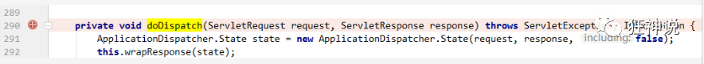

3、我们启动我们的项目，然后随便访问一个页面，看一下Debug信息；

找到this

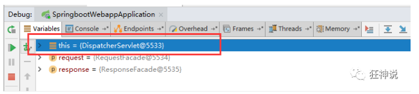

找到视图解析器，我们看到我们自己定义的就在这里了；

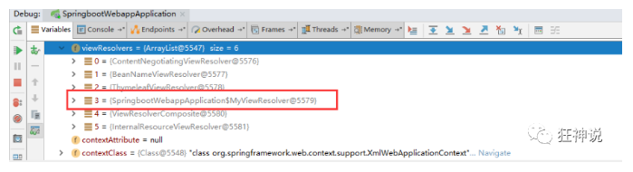

所以说，我们如果想要使用自己定制化的东西，我们只需要给容器中添加这个组件就好了！剩下的事情SpringBoot就会帮我们做了！


### 转换器和格式化器

找到格式化转换器：

```java
@Bean
@Override
public FormattingConversionService mvcConversionService() {
    // 拿到配置文件中的格式化规则
    WebConversionService conversionService = 
        new WebConversionService(this.mvcProperties.getDateFormat());
    addFormatters(conversionService);
    return conversionService;
}
```

点击去：

```java
public String getDateFormat() {
    return this.dateFormat;
}

/**
* Date format to use. For instance, `dd/MM/yyyy`. 默认的
 */
private String dateFormat;
```

可以看到在我们的Properties文件中，我们可以进行自动配置它！

如果配置了自己的格式化方式，就会注册到Bean中生效，我们可以在配置文件中配置日期格式化的规则：

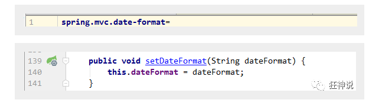

其余的就不一一举例了，大家可以下去多研究探讨即可！


### 修改SpringBoot的默认配置

这么多的自动配置，原理都是一样的，通过这个WebMVC的自动配置原理分析，我们要学会一种学习方式，通过源码探究，得出结论；这个结论一定是属于自己的，而且一通百通。

SpringBoot的底层，大量用到了这些设计细节思想，所以，没事需要多阅读源码！得出结论；

SpringBoot在自动配置很多组件的时候，先看容器中有没有用户自己配置的（如果用户自己配置@bean），如果有就用用户配置的，如果没有就用自动配置的；

如果有些组件可以存在多个，比如我们的视图解析器，就将用户配置的和自己默认的组合起来！

**扩展使用SpringMVC**  官方文档如下：

If you want to keep Spring Boot MVC features and you want to add additional MVC configuration (interceptors, formatters, view controllers, and other features), you can add your own @Configuration class of type WebMvcConfigurer but without @EnableWebMvc. If you wish to provide custom instances of RequestMappingHandlerMapping, RequestMappingHandlerAdapter, or ExceptionHandlerExceptionResolver, you can declare a WebMvcRegistrationsAdapter instance to provide such components.

我们要做的就是编写一个@Configuration注解类，并且类型要为WebMvcConfigurer，还不能标注@EnableWebMvc注解；我们去自己写一个；我们新建一个包叫config，写一个类MyMvcConfig；

```java
//应为类型要求为WebMvcConfigurer，所以我们实现其接口
//可以使用自定义类扩展MVC的功能
@Configuration
public class MyMvcConfig implements WebMvcConfigurer {

    @Override
    public void addViewControllers(ViewControllerRegistry registry) {
        // 浏览器发送/test ， 就会跳转到test页面；
        registry.addViewController("/test").setViewName("test");
    }
}
```

我们去浏览器访问一下：


**确实也跳转过来了！所以说，我们要扩展SpringMVC，官方就推荐我们这么去使用，既保SpringBoot留所有的自动配置，也能用我们扩展的配置！**

我们可以去分析一下原理：

1、WebMvcAutoConfiguration 是 SpringMVC的自动配置类，里面有一个类WebMvcAutoConfigurationAdapter

2、这个类上有一个注解，在做其他自动配置时会导入：@Import(EnableWebMvcConfiguration.class)

3、我们点进EnableWebMvcConfiguration这个类看一下，它继承了一个父类：DelegatingWebMvcConfiguration

这个父类中有这样一段代码：

```java
public class DelegatingWebMvcConfiguration extends WebMvcConfigurationSupport {
    private final WebMvcConfigurerComposite configurers = new WebMvcConfigurerComposite();
    
  // 从容器中获取所有的webmvcConfigurer
    @Autowired(required = false)
    public void setConfigurers(List<WebMvcConfigurer> configurers) {
        if (!CollectionUtils.isEmpty(configurers)) {
            this.configurers.addWebMvcConfigurers(configurers);
        }
    }
}
```

4、我们可以在这个类中去寻找一个我们刚才设置的viewController当做参考，发现它调用了一个

```java
protected void addViewControllers(ViewControllerRegistry registry) {
    this.configurers.addViewControllers(registry);
}
```

5、我们点进去看一下

```java
public void addViewControllers(ViewControllerRegistry registry) {
    Iterator var2 = this.delegates.iterator();

    while(var2.hasNext()) {
        // 将所有的WebMvcConfigurer相关配置来一起调用！包括我们自己配置的和Spring给我们配置的
        WebMvcConfigurer delegate = (WebMvcConfigurer)var2.next();
        delegate.addViewControllers(registry);
    }

}
```

所以得出结论：所有的WebMvcConfiguration都会被作用，不止Spring自己的配置类，我们自己的配置类当然也会被调用；


## 全面接管SpringMVC

官方文档：

```
If you want to take complete control of Spring MVC
you can add your own @Configuration annotated with @EnableWebMvc.
```

全面接管即：SpringBoot对SpringMVC的自动配置不需要了，所有都是我们自己去配置！

只需在我们的配置类中要加一个@EnableWebMvc。

我们看下如果我们全面接管了SpringMVC了，我们之前SpringBoot给我们配置的静态资源映射一定会无效，我们可以去测试一下；

不加注解之前，访问首页：


给配置类加上注解：@EnableWebMvc

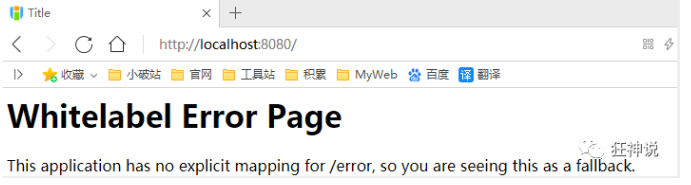

我们发现所有的SpringMVC自动配置都失效了！回归到了最初的样子；

**当然，我们开发中，不推荐使用全面接管SpringMVC**

思考问题？为什么加了一个注解，自动配置就失效了！我们看下源码：

1、这里发现它是导入了一个类，我们可以继续进去看

```java
Import({DelegatingWebMvcConfiguration.class})
public @interface EnableWebMvc {
}
```

2、它继承了一个父类 WebMvcConfigurationSupport

```java
public class DelegatingWebMvcConfiguration extends WebMvcConfigurationSupport {
  // ......
}
```

3、我们来回顾一下Webmvc自动配置类

```java
@Configuration(proxyBeanMethods = false)
@ConditionalOnWebApplication(type = Type.SERVLET)
@ConditionalOnClass({ Servlet.class, DispatcherServlet.class, WebMvcConfigurer.class })
// 这个注解的意思就是：容器中没有这个组件的时候，这个自动配置类才生效
@ConditionalOnMissingBean(WebMvcConfigurationSupport.class)
@AutoConfigureOrder(Ordered.HIGHEST_PRECEDENCE + 10)
@AutoConfigureAfter({ DispatcherServletAutoConfiguration.class, TaskExecutionAutoConfiguration.class,
    ValidationAutoConfiguration.class })
public class WebMvcAutoConfiguration {
    
}
```

总结一句话：@EnableWebMvc将WebMvcConfigurationSupport组件导入进来了；

而导入的WebMvcConfigurationSupport只是SpringMVC最基本的功能！

**在SpringBoot中会有非常多的扩展配置，只要看见了这个，我们就应该多留心注意~**


## 自定义Starter


我们分析完毕了源码以及自动装配的过程，我们可以尝试自定义一个启动器来玩玩！

### 说明

启动器模块是一个 空 jar 文件，仅提供辅助性依赖管理，这些依赖可能用于自动装配或者其他类库；

**命名归约：**

官方命名：

- 前缀：spring-boot-starter-xxx
- 比如：spring-boot-starter-web....

自定义命名：

- xxx-spring-boot-starter
- 比如：mybatis-spring-boot-starter


### 编写启动器

1、在IDEA中新建一个空项目 spring-boot-starter-diy

2、新建一个普通Maven模块：kuang-spring-boot-starter


3、新建一个Springboot模块：kuang-spring-boot-starter-autoconfigure

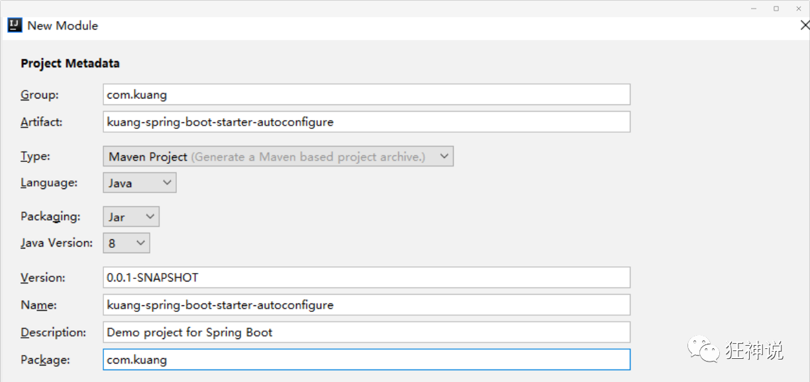

4、点击apply即可，基本结构

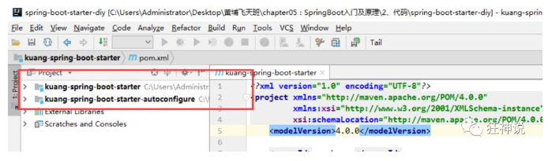

5、在我们的 starter 中 导入  autoconfigure 的依赖！

```xml
<!-- 启动器 -->
<dependencies>
    <!--  引入自动配置模块 -->
    <dependency>
        <groupId>com.kuang</groupId>
        <artifactId>kuang-spring-boot-starter-autoconfigure</artifactId>
        <version>0.0.1-SNAPSHOT</version>
    </dependency>
</dependencies>
```

6、将 autoconfigure 项目下多余的文件都删掉，Pom中只留下一个 starter，这是所有的启动器基本配置！

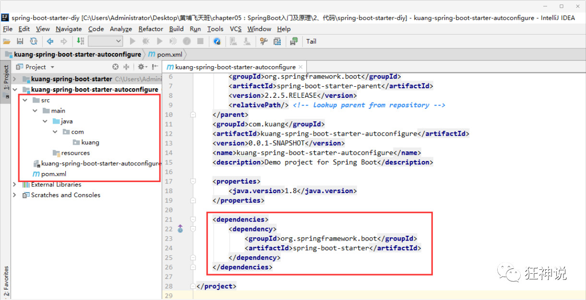

7、我们编写一个自己的服务

```java
package com.kuang;

public class HelloService {

    HelloProperties helloProperties;

    public HelloProperties getHelloProperties() {
        return helloProperties;
    }

    public void setHelloProperties(HelloProperties helloProperties) {
        this.helloProperties = helloProperties;
    }

    public String sayHello(String name){
        return helloProperties.getPrefix() + name + helloProperties.getSuffix();
    }

}
```

8、编写HelloProperties 配置类

```java
package com.kuang;

import org.springframework.boot.context.properties.ConfigurationProperties;

// 前缀 kuang.hello
@ConfigurationProperties(prefix = "kuang.hello")
public class HelloProperties {

    private String prefix;
    private String suffix;

    public String getPrefix() {
        return prefix;
    }

    public void setPrefix(String prefix) {
        this.prefix = prefix;
    }

    public String getSuffix() {
        return suffix;
    }

    public void setSuffix(String suffix) {
        this.suffix = suffix;
    }
}
```

9、编写我们的自动配置类并注入bean，测试！

```java
package com.kuang;

import org.springframework.beans.factory.annotation.Autowired;
import org.springframework.boot.autoconfigure.condition.ConditionalOnWebApplication;
import org.springframework.boot.context.properties.EnableConfigurationProperties;
import org.springframework.context.annotation.Bean;
import org.springframework.context.annotation.Configuration;

@Configuration
@ConditionalOnWebApplication //web应用生效
@EnableConfigurationProperties(HelloProperties.class)
public class HelloServiceAutoConfiguration {

    @Autowired
    HelloProperties helloProperties;

    @Bean
    public HelloService helloService(){
        HelloService service = new HelloService();
        service.setHelloProperties(helloProperties);
        return service;
    }

}
```

10、在resources编写一个自己的 META-INF\spring.factories

```factories
# Auto Configure
org.springframework.boot.autoconfigure.EnableAutoConfiguration=\
com.kuang.HelloServiceAutoConfiguration
```

11、编写完成后，可以安装到maven仓库中！

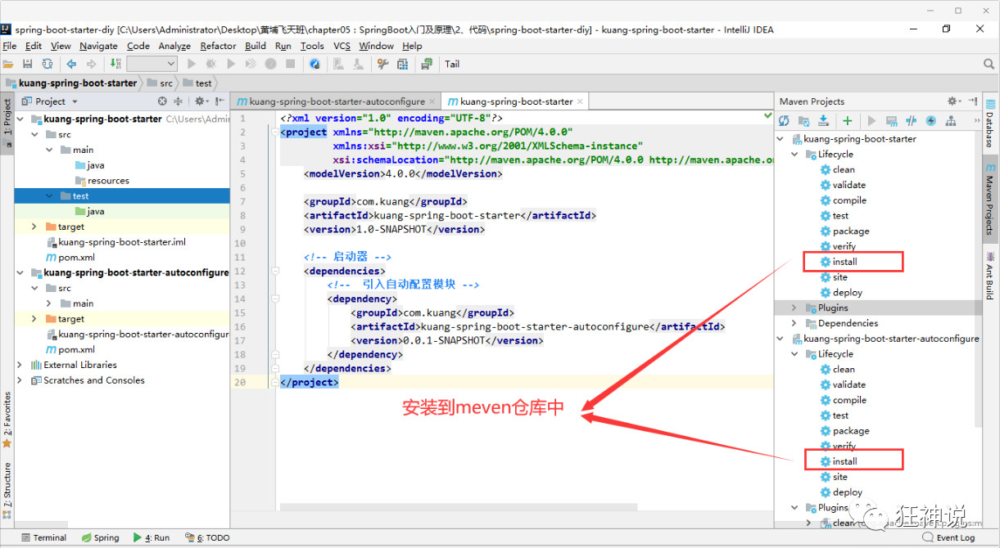


### 新建项目测试我们自己写的启动器

1、新建一个SpringBoot 项目

2、导入我们自己写的启动器

```xml
<dependency>
    <groupId>com.kuang</groupId>
    <artifactId>kuang-spring-boot-starter</artifactId>
    <version>1.0-SNAPSHOT</version>
</dependency>
```

3、编写一个 HelloController  进行测试我们自己的写的接口！

```java
package com.kuang.controller;

@RestController
public class HelloController {

    @Autowired
    HelloService helloService;

    @RequestMapping("/hello")
    public String hello(){
        return helloService.sayHello("zxc");
    }

}
```

4、编写配置文件 application.properties

```properties
kuang.hello.prefix="ppp"
kuang.hello.suffix="sss"
```

5、启动项目进行测试，结果成功 !

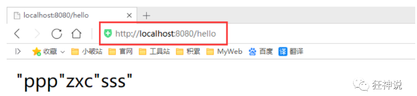


## 页面国际化


有的时候，我们的网站会去涉及中英文甚至多语言的切换，这时候我们就需要学习国际化了！

### 准备工作

先在IDEA中统一设置properties的编码问题！

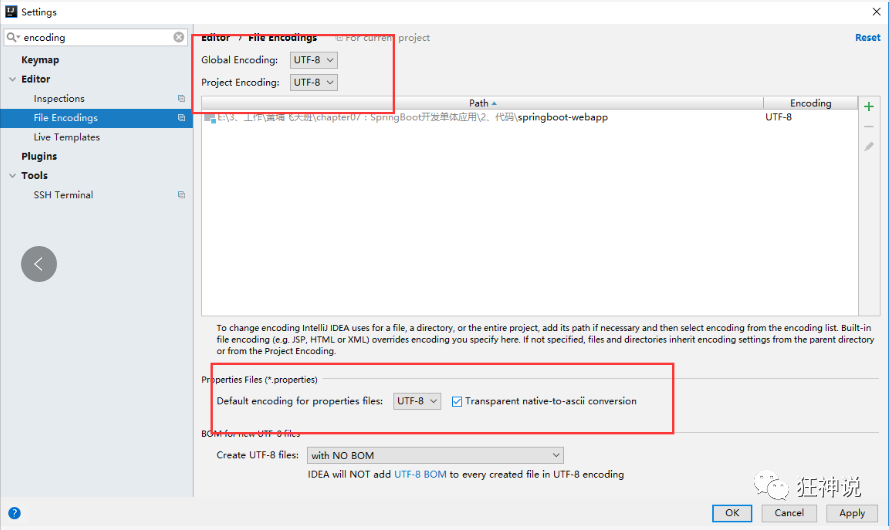

编写国际化配置文件，抽取页面需要显示的国际化页面消息。我们可以去登录页面查看一下，哪些内容我们需要编写国际化的配置！

### 配置文件编写

1、我们在resources资源文件下新建一个i18n目录，存放国际化配置文件

2、建立一个login.properties文件，还有一个login_zh_CN.properties；发现IDEA自动识别了我们要做国际化操作；文件夹变了！


3、我们可以在这上面去新建一个文件；

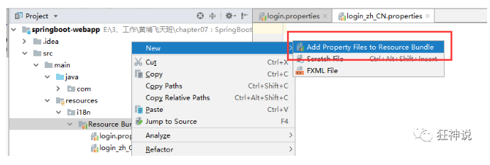

弹出如下页面：我们再添加一个英文的；

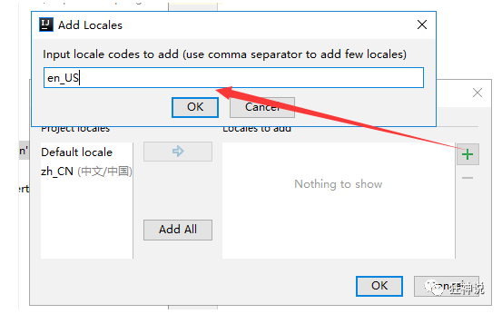

这样就快捷多了！

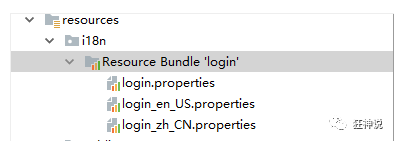

**4、接下来，我们就来编写配置，我们可以看到idea下面有另外一个视图；**


这个视图我们点击 + 号就可以直接添加属性了；我们新建一个login.tip，可以看到边上有三个文件框可以输入

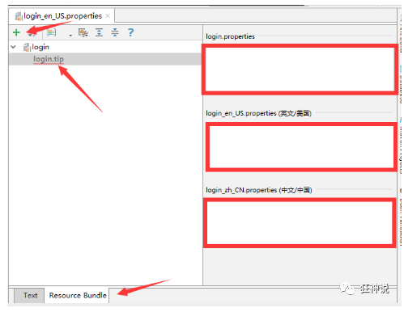

我们添加一下首页的内容！

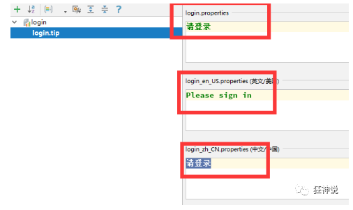

然后依次添加其他页面内容即可！

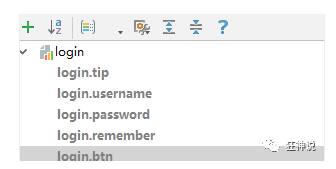

然后去查看我们的配置文件；

login.properties ：默认

```properties
login.btn=登录
login.password=密码
login.remember=记住我
login.tip=请登录
login.username=用户名
```

英文：

```properties
login.btn=Sign in
login.password=Password
login.remember=Remember me
login.tip=Please sign in
login.username=Username
```

中文：

```properties
login.btn=登录
login.password=密码
login.remember=记住我
login.tip=请登录
login.username=用户名
```

OK，配置文件步骤搞定！


### 配置文件生效探究

我们去看一下SpringBoot对国际化的自动配置！这里又涉及到一个类：MessageSourceAutoConfiguration

里面有一个方法，这里发现SpringBoot已经自动配置好了管理我们国际化资源文件的组件 ResourceBundleMessageSource；

```java
// 获取 properties 传递过来的值进行判断
@Bean
public MessageSource messageSource(MessageSourceProperties properties) {
    ResourceBundleMessageSource messageSource = new ResourceBundleMessageSource();
    if (StringUtils.hasText(properties.getBasename())) {
        // 设置国际化文件的基础名（去掉语言国家代码的）
        messageSource.setBasenames(
            StringUtils.commaDelimitedListToStringArray(
                                       StringUtils.trimAllWhitespace(properties.getBasename())));
    }
    if (properties.getEncoding() != null) {
        messageSource.setDefaultEncoding(properties.getEncoding().name());
    }
    messageSource.setFallbackToSystemLocale(properties.isFallbackToSystemLocale());
    Duration cacheDuration = properties.getCacheDuration();
    if (cacheDuration != null) {
        messageSource.setCacheMillis(cacheDuration.toMillis());
    }
    messageSource.setAlwaysUseMessageFormat(properties.isAlwaysUseMessageFormat());
    messageSource.setUseCodeAsDefaultMessage(properties.isUseCodeAsDefaultMessage());
    return messageSource;
}
```

我们真实 的情况是放在了i18n目录下，所以我们要去配置这个messages的路径；

```properties
spring.messages.basename=i18n.login
```


### 配置页面国际化值

去页面获取国际化的值，查看Thymeleaf的文档，找到message取值操作为：#{...}。我们去页面测试下：

IDEA还有提示，非常智能的！

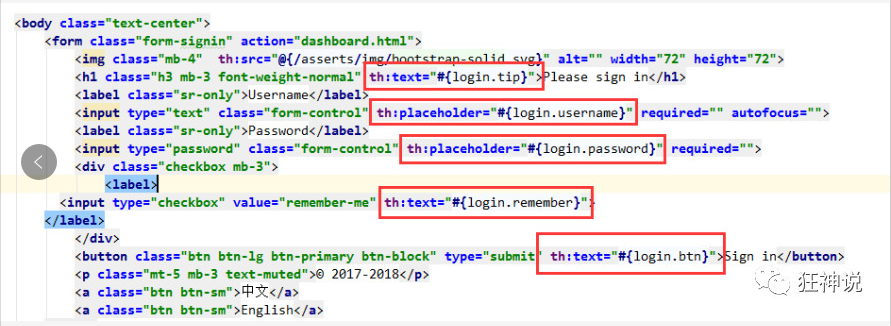

我们可以去启动项目，访问一下，发现已经自动识别为中文的了！


**但是我们想要更好！可以根据按钮自动切换中文英文！**

### 配置国际化解析

在Spring中有一个国际化的Locale （区域信息对象）；里面有一个叫做LocaleResolver （获取区域信息对象）的解析器！

我们去我们webmvc自动配置文件，寻找一下！看到SpringBoot默认配置：

```java
@Bean
@ConditionalOnMissingBean
@ConditionalOnProperty(prefix = "spring.mvc", name = "locale")
public LocaleResolver localeResolver() {
    // 容器中没有就自己配，有的话就用用户配置的
    if (this.mvcProperties.getLocaleResolver() == WebMvcProperties.LocaleResolver.FIXED) {
        return new FixedLocaleResolver(this.mvcProperties.getLocale());
    }
    // 接收头国际化分解
    AcceptHeaderLocaleResolver localeResolver = new AcceptHeaderLocaleResolver();
    localeResolver.setDefaultLocale(this.mvcProperties.getLocale());
    return localeResolver;
}
```

AcceptHeaderLocaleResolver 这个类中有一个方法

```java
public Locale resolveLocale(HttpServletRequest request) {
    Locale defaultLocale = this.getDefaultLocale();
    // 默认的就是根据请求头带来的区域信息获取Locale进行国际化
    if (defaultLocale != null && request.getHeader("Accept-Language") == null) {
        return defaultLocale;
    } else {
        Locale requestLocale = request.getLocale();
        List<Locale> supportedLocales = this.getSupportedLocales();
        if (!supportedLocales.isEmpty() && !supportedLocales.contains(requestLocale)) {
            Locale supportedLocale = this.findSupportedLocale(request, supportedLocales);
            if (supportedLocale != null) {
                return supportedLocale;
            } else {
                return defaultLocale != null ? defaultLocale : requestLocale;
            }
        } else {
            return requestLocale;
        }
    }
}
```

那假如我们现在想点击链接让我们的国际化资源生效，就需要让我们自己的Locale生效！

我们去自己写一个自己的LocaleResolver，可以在链接上携带区域信息！

修改一下前端页面的跳转连接：

```html
<!-- 这里传入参数不需要使用 ？使用 （key=value）-->
<a class="btn btn-sm" th:href="@{/index.html(l='zh_CN')}">中文</a>
<a class="btn btn-sm" th:href="@{/index.html(l='en_US')}">English</a>
```

我们去写一个处理的组件类！

```java
package com.kuang.component;

import org.springframework.util.StringUtils;
import org.springframework.web.servlet.LocaleResolver;

import javax.servlet.http.HttpServletRequest;
import javax.servlet.http.HttpServletResponse;
import java.util.Locale;

//可以在链接上携带区域信息
public class MyLocaleResolver implements LocaleResolver {

    //解析请求
    @Override
    public Locale resolveLocale(HttpServletRequest request) {

        String language = request.getParameter("l");
        Locale locale = Locale.getDefault(); // 如果没有获取到就使用系统默认的
        //如果请求链接不为空
        if (!StringUtils.isEmpty(language)){
            //分割请求参数
            String[] split = language.split("_");
            //国家，地区
            locale = new Locale(split[0],split[1]);
        }
        return locale;
    }

    @Override
    public void setLocale(HttpServletRequest httpServletRequest, HttpServletResponse httpServletResponse, Locale locale) {

    }
}
```

为了让我们的区域化信息能够生效，我们需要再配置一下这个组件！在我们自己的MvcConofig下添加bean；

```java
@Bean
public LocaleResolver localeResolver(){
    return new MyLocaleResolver();
}
```

**我们重启项目，来访问一下，发现点击按钮可以实现成功切换！搞定收工！**


xxxTemplate ：Springboot已经配置好的模板bean，拿来即用。