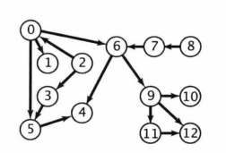
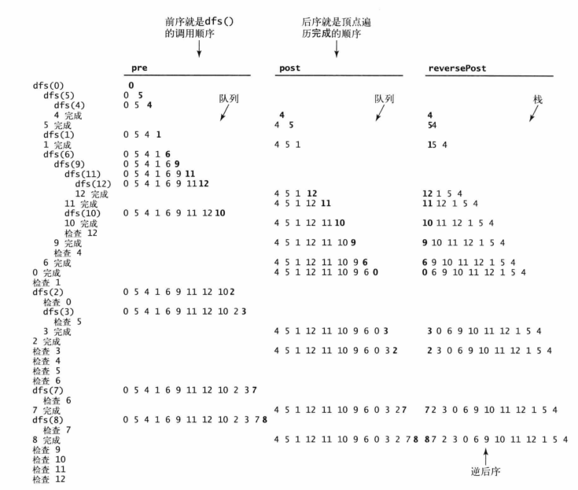
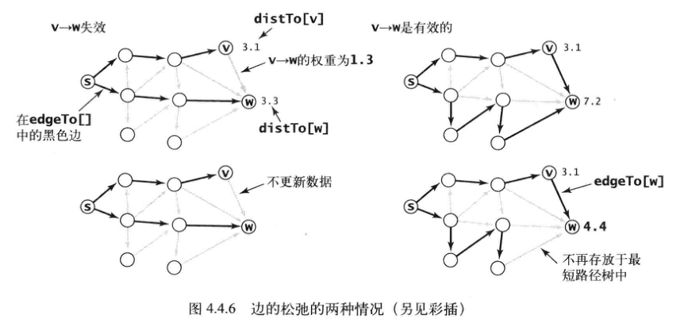

# 第四章 图

## 4.1 无向图

图：图是由一组顶点和一组能够将两个顶点相连的边组成的。

顶点：0~V-1

v-w：连接v和w的边

自环：一条连接一个顶点和其自身的边

平行边：连接同一对顶点的两条边

当两个顶点通过一条边相连时，称这两个顶点是相邻的，称这条边依附于这两个顶点。

顶点的度数：依附于该顶点的边总数

路径：由边顺序连接的一系列顶点

简单路径：一条没有重复顶点的路径

环：至少含有一条边，起止点相同

简单环：一条不含重复顶点和边的环

连通：当两个顶点之间存在一条连接双方的路径时，称一个顶点和另一个顶点是连通的

连通图：从任意一个顶点都存在一条路径到达另一个任意顶点

极大连通子图：一副非连通的图由若干连通的部分组成，它们都是极大联通子图

无环图：一种不包含环的图

树是一幅无环连通图。

森林：互不相连的树的集合称为森林

当一幅含有V个结点的图G满足下列5个条件之一时，就是一棵树：

1. G有V-1条边且不含有环
2. G有V-1条边且是连通的
3. G是连通的，但删除任意一条边都会使它不再连通
4. G是无环图，但添加任意一条边都会产生一条环
5. G中的任意一对顶点之间仅存在一条简单路径

图的密度：已经连接的顶点对占所有可能被连接的顶点对的比例。稀疏图中，被连接的顶点对很少，稠密图中，只有少部分顶点对之间没有边连接

二分图：能够将所有结点分为两部分的图，其中图的每条边所连接的两个顶点都分别属于不同部分

无向图API：

~~~java
public class Graph
    Graph(int V);//创建含有V个顶点但不含边的图
    Graph(In in);//从标准输入流in读入一幅图
    int V();//顶点数
	int E();//边数
	void addEdge(int v, int w);//向图中添加一条边v-w
	Iterable<Integer> adj(int v);//和v相邻的所有顶点
	String toString();//对象的字符串表示
~~~

计算v的度数：

~~~java
public static int degree(Graph G, int V) {
    int degree = 0;
    for (int w: G.adj(v)) degree++;
    return degree;
}
~~~

计算所有顶点的最大度数：

~~~java
public static int maxDegree(Graph G) {
    int max = 0;
    for (int v = 0; v < G.V(); v++) {
        if (degree(G, v) > max) max = degree(G, v);
    }
    return max;
}
~~~

计算所有顶点的平均度数：

~~~java
public static double avgDegree(Graph G) {
    return 2.0*G.E()/G.V();//一条边对应两个顶点
}
~~~

计算自环的个数：

~~~java
public static int numberOfSelfLoops(Graph G) {
    int count = 0;
    for (int v = 0; v < G.V(); v++) {
        for (int w: G.adj(v))
            if (w==v) count++;
    }
    return count/2;//每条边都被记过两次
}
~~~

图的邻接表的字符串（Graph的实例方法）：

~~~java
public String toString() {
    String s = V + " vertices, " + E + " edges\n";
    for (int v = 0; v < V; v++) {
        s += v + ": ";
        for (int w : this.adj(v)) 
            s += w + " ";
        s += "\n";
    }
    return s;
}
~~~

图的表示方法（数据结构）：邻接表数组：使用一个以顶点为索引的列表数组，其中每个元素都是和该顶点相邻的顶点列表（使用第一章中的Bag数据结构）。好处：1. 占用空间低（小于V^2个元素）2. 实例方法快！

这种数据结构的特点：

1. 使用的空间和V+E成正比
2. 添加一条边所需的时间为常数
3. 遍历顶点v的相邻结点所需时间和v的度数成正比（处理每个相邻顶点所需的时间为常数）

Graph数据类型：

~~~java
package algs4;
import edu.princeton.cs.algs4.In;

public class Graph {
    private final int V;
    private int E;
    private Bag<Integer>[] adj;
    public Graph(int V) {
        this.V = V;
        this.E = 0;
        adj = (Bag<Integer>[]) new Bag[V];
        for (int v = 0; v < V; v++) {
            adj[v] = new Bag<Integer>();
        }
    }
    public Graph(In in) {
        this(in.readInt());
        int E = in.readInt();
        for (int i = 0; i < E; i++) {
            int v = in.readInt();
            int w = in.readInt();
            addEdge(v, w);
        }
    }
    public int V() { return V; }
    public int E() { return E; }
    public void addEdge(int v, int w) {
        adj[v].add(w);
        adj[w].add(v);
        E++;
    }
    public Iterable<Integer> adj(int v) {
        return adj[v];
    }
    public String toString() {
        String s = V + " vertices, " + E + " edges\n";
        for (int v = 0; v < V; v++) {
            s += v + ": ";
            for (int w : this.adj(v))
                s += w + " ";
            s += "\n";
        }
        return s;
    }
}

~~~

深度优先搜索：解决两个结点之间是否存在路径的问题

图处理算法的API（热身）：

~~~java
public class Search {
    Search(Graph G, int s)//找到和起点s连通的所有顶点
    boolean marked(int v)//v和s是连通的吗
    int count()//与s连通的顶点总数
}
~~~

起点：传递给构造函数的参数（区别于其他顶点）

方法名marked()指的是这种基本算法使用的一种实现方式：在图中从起点开始沿着路径到达其他顶点并标记每个路过的顶点。

图的许多性质与路径有关。

上例的深度优先搜索：要搜索所有和起点连通的顶点，只需要用一个递归方法来遍历所有连通顶点，在访问其中一个顶点时：

- 将它标记为已访问
- 递归地访问它所有没有被访问过的邻居顶点

~~~java
public class DepthFirstSearch {
    private boolean[] marked;
    private int count;
    
    public DepthFirstSearch(Graph G, int s) {
        marked = new boolean[G.V()];
        dfs(G,s);
    }
    private void dfs(Graph G, int v) {
        marked[v] = true;
        count++;
        for (int w : G.adj(v))
            if(!marked[w]) dfs(G, w);
    }
    public boolean marked(int w) { return marked[w]; }
    public int count() { return count; }
}
~~~

**命题A 深度优先搜索标记与起点连通的所有顶点所需的时间和顶点的度数之和成正比。**

算法遍历边和访问顶点的顺序与图的表示是有关的，而不只是与图的结构或是算法有关。

深度优先搜索中每条边都会被访问两次，且在第二次时总会发现这个顶点已经被标记过。（搜索下一个顶点时，总是会搜索其所有邻居结点，包括上一个结点。）

热身结束。

寻找路径：

单点路径：给定一幅图和一个起点s，回答“从s到给定目的顶点v是否存在一条路径？如果有，找出这条路径。”等类似问题。

路径的API：

~~~java
public class Paths {
    Paths(Graph G, int s) //在G中找出所有起点为s的路径
    boolean hasPathTo(int v) //是否存在一条从s到v的路径
    Iterable<Integer> pathTo(int v) //s到v的路径，如果不存在则返回null
}
~~~

实现：添加一个 实例变量edgeTo[]，记住每个顶点到起点的路径，长度为图的顶点个数，每个元素表示到某一个顶点的前一个顶点：

~~~java
public class DepthFirstPaths {
    private boolean[] marked;
    private int[] edgeTo;
    private final int s;

    public DepthFirstPaths(Graph G, int s) {
        marked = new boolean[G.V()];
        edgeTo = new int[G.V()];
        this.s = s;
        dfs(G, s);
    }

    private void dfs(Graph G, int v) {
        marked[v] = true;
        for (int w : G.adj(v)) {
            if (!marked[w]) {
                edgeTo[w] = v;
                dfs(G, w);
            }
        }
    }
    public boolean hasPathTo(int v) {
        return marked[v];
    }
    public Iterable<Integer> pathTo(int v) {
        if (!hasPathTo(v)) { return null; }
        Stack<Integer> path = new Stack<>();
        for (int x = v; x != s; x = edgeTo[x]) {
            path.push(x);
        }
        path.push(s);
        return path;
    }

    public static void main(String[] args) {
        Graph G = new Graph(new In(args[0]));
        int s = Integer.parseInt(args[1]);
        DepthFirstPaths search = new DepthFirstPaths(G, s);
        for (int v = 0; v < G.V(); v++) {
            StdOut.print(s + " to " + v + ": ");
            if (search.hasPathTo(v))
                for (int x : search.pathTo(v))
                    if (x == s)StdOut.print(x);
                    else StdOut.print("-" + x);
            StdOut.println();
        }
    }
}
~~~

命题A（续）：使用深度优先搜索得到从给定起点到任意标记顶点的路径所需的时间与路径长度成正比。

广度优先搜索：解决找出两结点间最短的路径的问题

实现：使用一个队列来保存所有已经被标记过但其邻接表还未被检查过的顶点。先将起点加入队列，额庵后重复一下步骤直到队列为空：

- 取队列的下一个顶点v并标记它
- 将与v相邻的所有未被标记过的顶点加入队列（即先标记，再加入队列）

其结果也是一个edgeRo[]数组，表示起点s到每个与s连通的顶点的**最短路径**。

~~~java
public class BreadthFirstPaths {
    private boolean[] marked;
    private int[] edgeTo;
    private final int s;

    public BreadthFirstPaths(Graph G, int s) {
        marked = new boolean[G.V()];
        edgeTo = new int[G.V()];
        this.s = s;
        bfs(G, s);
    }

    private void bfs(Graph G, int s) {
        Queue<Integer> queue = new Queue<>();
        marked[s] = true;
        queue.enqueue(s);

        while(!queue.isEmpty()) {
            int v = queue.dequeue();
            for (int w : G.adj(v)) {
                if (!marked[w]){
                    edgeTo[w] = v;
                    marked[w] = true;
                    queue.enqueue(w);
                }
            }
        }
    }

    public boolean hasPathTo(int v) {
        return marked[v];
    }

    public Iterable<Integer> pathTo(int v) {
        if (!hasPathTo(v)) { return null; }
        Stack<Integer> path = new Stack<>();
        for (int x = v; x != s; x = edgeTo[x]) {
            path.push(x);
        }
        path.push(s);
        return path;
    }
    public static void main(String[] args) {
        Graph G = new Graph(new In(args[0]));
        int s = Integer.parseInt(args[1]);
        BreadthFirstPaths search = new BreadthFirstPaths(G, s);
        for (int v = 0; v < G.V(); v++) {
            StdOut.print(s + " to " + v + ": ");
            if (search.hasPathTo(v))
                for (int x : search.pathTo(v))
                    if (x == s)StdOut.print(x);
                    else StdOut.print("-" + x);
            StdOut.println();
        }
    }
}
~~~

命题B：对于从s可达的任意顶点v，广度优先搜索都能找到一条从s到v的最短路径（没有其他从s到v的路径所包含的边比这条路径更少）。

命题B（续）：广度优先搜索所需时间在最坏情况下和V+E成正比。如果图是连通的，这个和就是所有顶点的度数之和，也就是2E。

深度优先和广度优先搜索都会先将起点存入数据结构中，然后重复以下步骤直达数据结构被清空：

- 取其中的下一个顶点并标记它。
- 将v的所有相邻而又未被标记的顶点加入数据结构。

两者的不同仅在于从数据结构中获取下一个顶点的规则。（BFS：先进先出；DFS：后进先出）

连通分量：

连通分量的API：

~~~java
public class CC {
    CC(Graph G)//预处理构造函数
    boolean connected(int v, int w)//v和w连通吗
    int count()//连通分量数
    int id(int v)//v所在的连通分量的标识符（0~count()-1）
}
~~~

深度优先搜索找出图中的所有连通分量：

~~~java
public class CC {
    private boolean[] marked;
    private int[] id;
    private int count;

    public CC(Graph G) {
        marked = new boolean[G.V()];
        id = new int[G.V()];
        for (int s = 0; s < G.V(); s++) {
            if (!marked[s]) {
                dfs(G, s);
                count++;
            }
        }
    }
    private void dfs(Graph G, int v) {
        marked[v] = true;
        id[v] = count;
        for (int w : G.adj(v)) {
            if(!marked[w]) dfs(G, w);
        }
    }
    public boolean connected(int v, int w) {
        return id[v] == id[w];
    }
    public int id(int v) {
        return id[v];
    }
    public int count() {
        return count;
    }

    public static void main(String[] args) {
        Graph G = new Graph(new In(args[0]));
        CC cc = new CC(G);

        int M = cc.count;
        StdOut.println(M + " components");

        Bag<Integer>[] components;
        components = (Bag<Integer>[]) new Bag[M];
        for (int i = 0; i < M; i++) {//注意初始化时，不能使用for each
            components[i] = new Bag<>();
        }
        for (int v = 0; v < G.V(); v++) {
            components[cc.id(v)].add(v);
        }

        for (int i = 0; i < M; i++) {
            for (int v : components[i]) {
                StdOut.print(v + " ");
            }
            StdOut.println();
        }
    }
}
~~~

命题C：深度优先搜索的预处理使用的时间和空间与V+E成正比且可以在常数时间内处理关于图的连通性查询。（每个邻接表的元素都会被查询一次，共2E个元素）

深度优先理论上比union-find快，但实际上union-find更快，因为他不需要完整构造一幅图。因此在完成只需要判断连通性或是需要完成大量连通性查询和插入操作混合等类似任务时，使用union-find算法。且深度优先搜索方法需要预处理，而union-find是动态的。

深度优先搜索则更适合实现图的抽象数据类型，因为它能更有效地利用已有的数据结构。

判断G是无环图吗？：

~~~java
public class Cycle {//G是无环图吗？
    private boolean[] marked;
    private boolean hasCycle;
    public Cycle(Graph G) {
        marked = new boolean[G.V()];
        for (int s = 0; s < G.V(); s++) {
            if (!marked[s])dfs(G, s, s);
        }
    }

    private void dfs(Graph G, int v, int u) {
        marked[v] = true;
        for (int w : G.adj(v)) {
            if (!marked[w])dfs(G, w, v);
            else if(w != u) {hasCycle = true;}
        }
    }
    public boolean hasCycle() {
        return hasCycle;
    }
}
~~~

G是二分图吗？（双色问题）：

~~~java
public class TwoColor {//G是二分图吗？（双色问题）
    private boolean[] marked;
    private boolean[] color;
    private boolean isTwoColorable = true;
    public TwoColor(Graph G) {
        marked = new boolean[G.V()];
        color = new boolean[G.V()];
        for (int s = 0; s < G.V(); s++) {
            if (!marked[s])dfs(G, s);
        }
    }

    private void dfs(Graph G, int v) {
        marked[v] = true;
        for (int w : G.adj(v)) {
            if (!marked[w]) {
                color[w] = !color[v];
                dfs(G, w);
            }
            else if (color[w] == color[v]) isTwoColorable = false;
        }
    }
    public boolean isBipartite() {
        return isTwoColorable;
    }
}
~~~

符号图：

在典型应用中，图都是通过文件或网页来定义的，使用的是字符而非整数来表示和指代顶点。为了适应这样的应用，定义拥有以下性质的输入格式：

- 顶点名为字符串
- 用指定的分隔符来隔开顶点名（允许顶点名中有空格）
- 每一行都表示一组边的集合，每一条边都连接着这一行的第一个名称表示的顶点和其他名称所表示的顶点。
- 顶点总数V和边的总数E都是隐式定义的

API：

~~~java
public class SymbolGraph{
    SymbolGraph(String filename, String delim)//根据filename指定的文件构造图，使用delim来分隔顶点名
    boolean contains(String key)//key是一个顶点吗
    int index(String key)//key的索引
    String name(int v)//索引v的顶点名
    Graph G()//隐藏的Graph对象
}
~~~

测试用例：

~~~java
public static void main(String[] args) {
    String filename = args[0];
    String delim = args[1];
    SymbolGraph sg = new SymbolGraph(filename, delim);
    
    Graph G = sg.G();
    
    while (StdIn.hasNextLine()) {
        String source = StdIn.readLine();
        for (int w : G.adj(sg.index(source))) StdOut.println("	" + sg.name(w));
    }
}
~~~

用例可以用index()将顶点名转化为索引并在图的处理算法中使用。

符号图的数据类型：

~~~java
public class SymbolGraph {
    private TreeMap<String, Integer> st;
    private String[] keys;
    private Graph G;

    public SymbolGraph(String stream, String sp) {
        st = new TreeMap<>();
        In in = new In(stream);
        while (in.hasNextLine()) {
            String[] a = in.readLine().split(sp);

            for (int i = 0; i < a.length; i++) {
                if (!st.containsKey(a[i])) st.put(a[i], st.size());
            }
        }
        keys = new String[st.size()];

        for (String name : st.keySet()) {
            keys[st.get(name)] = name;
        }

        G = new Graph(st.size());
        in = new In(stream);
        while (in.hasNextLine()) {
            String[] a = in.readLine().split(sp);
            int v = st.get(a[0]);
            for (int i = 1; i < a.length; i++) {
                G.addEdge(v, st.get(a[i]));
            }
        }
    }

    public boolean contains(String s) {return st.containsKey(s);}
    public int index(String s) {return st.get(s);}
    public String name(int v) {return keys[v];}
    public Graph G() {return G;}

    public static void main(String[] args) {
        String filename = args[0];
        String delim = args[1];
        SymbolGraph sg = new SymbolGraph(filename, delim);

        Graph G = sg.G();

        while (StdIn.hasNextLine()) {
            String source = StdIn.readLine();
            for (int w : G.adj(sg.index(source))) StdOut.println("	" + sg.name(w));
        }
    }
}
~~~

## 4.2  有向图

在有向图中，边是单向的。

出度：由该顶点指出的边的总数。

入度：指向该顶点的边的总数。

一条有向边的第一个顶点政委它的头，第二个顶点称为它的尾。

简单有向环是一条不含有重复的顶点和边的环。

约定：每个顶点都能到达自己。

有向图的数据类型：

~~~java
public class Digraph {
    
    Digraph(int V);//创建一幅含有V个顶点但没有边的有向图
    
    Digraph(In in);//从输入流in中读取一幅有向图
    
    int V();//顶点总数
    
    int E();//边的总数
    
    void addEdge(int v, int w);//向有向图中添加一条边v->w
    
    Iterable<Integer> adj(int v);//由v指出的边所连接的所有顶点
    
    Digraph reverse();//该图的反向图（一个副本），用于找出指向每个顶点的所有边
    
    String toString();//对象的字符串表示
}
~~~

使用邻接表来表示有向图。

Digraph数据类型：

~~~java
public class Digraph {
    private int V;
    private int E;
    private Bag<Integer>[] adj;

    public Digraph(int V) {
        this.V = V;
        this.E = 0;
        adj = (Bag<Integer>[])new Bag[V];
        for (int v = 0; v < V; v++) {
            adj[v] = new Bag<Integer>();
        }
    }

    public Digraph(In in) {
        this(in.readInt());
        int E = in.readInt();
        for (int i = 0; i < E; i++) {
            int v = in.readInt();
            int w = in.readInt();
            addEdge(v, w);
        }
    }

    public void addEdge(int v, int w) {
        adj[v].add(w);
        E++;
    }

    public Iterable<Integer> adj(int v) { return adj[v]; }

    public Digraph reverse() {
        Digraph R = new Digraph(V);
        for (int v = 0; v < V; v++) {
            for (int w : adj(v)) R.addEdge(w, v);
        }
        return R;
    }

    public String toString() {
        String s = V + " vertices, " + E + " edges\n";
        for (int v = 0; v < V; v++) {
            s += v + ": ";
            for (int w : this.adj(v))
                s += w + " ";
            s += "\n";
        }
        return s;
    }
}
~~~

单点可达性：给定一幅有向图和一个起点s，回答“是否存在一条从s到达给定顶点v的有向路径？”等类似问题。（注意对比无向图的连通性问题）。

有向图的可达性API：（深度优先）

~~~java
public class DirectedDFS {
    DirectedDFS(Digraph G, int s);//在G中找到从s可达的所有顶点
    DirectedDFS(Digraph G, Iterable<Integer> sources);//在G中找到从sources中的所有顶点可达的所有顶点
    
    boolean marked(int v);
}
~~~

第二个构造函数用于解决多点可达性问题：给定一幅有向图和顶点的集合，回答“是否存在一条从集合中的任意顶点到达给定顶点v的有向路径？”等类似问题。

命题D：在有向图中，深度优先搜索标记由一个集合的顶点可达的所有顶点所需的时间与被标记的所有顶点的出度之和成正比。

~~~java
public class DirectedDFS {
    private boolean[] marked;

    public DirectedDFS(Digraph G, int s) {
        marked = new boolean[G.V()];
        dfs(G, s);
    }

    public DirectedDFS(Digraph G, Iterable<Integer> sources) {
        marked = new boolean[G.V()];
        for (int s :sources) {
            if (!marked[s]) dfs(G, s);
        }
    }

    private void dfs(Digraph G, int v) {
        marked[v] = true;
        for (int w : G.adj(v)) {
            if (!marked[w]) dfs(G, w);
        }
    }

    public boolean marked(int v) { return marked[v]; }

    public static void main(String[] args) {
        Digraph G = new Digraph(new In(args[0]));

        Bag<Integer> sources = new Bag<>();

        for (int i = 1; i < args.length; i++) {
            sources.add(Integer.parseInt(args[i]));
        }

        DirectedDFS reachable = new DirectedDFS(G, sources);

        for (int v = 0; v < G.V(); v++) {
            if (reachable.marked(v)) StdOut.print(v + " ");
        }
        StdOut.println();
    }
}
~~~

此问题的一个典型应用是java的垃圾回收：在一幅有向图中，一个顶点表示一个对象，一条边则表示一个对象对另外一个对象的引用，不能被其他对象访问到的对象将被回收以释放内存（此对象在图中不能由其他对象到达）。

4.1中的DepthFirstPaths和BreadthFirstPaths可解决单点有向路径和单点最短有向路径问题，只需将代码中的Graph改为Digraph即可：

单点有向路径：从s到给定目的顶点v是否存在一条有向路径？

单点最短路径：从s到给定目的顶点v是否存在一条有向路径？如果有，找出其中最短的那一条。

环和有向无环图：

有向图中的环：如果一个有优先级限制的问题中存在有向环，那么这个问题肯定是无解的。为了检测这种错误，需要进行有向环检测。

一旦哦到一条有向边v->w且w已经存在于栈中，就找到了一个环，因为栈表示的是一条由w到v的有向路径，而v->w正好补全了这个环。（递归调用的栈）

寻找有向环：

~~~java
public class DirectedCycle {
    private  boolean[] marked;
    private int[] edgeTo;
    private Stack<Integer> cycle;
    private boolean[] onStack;

    public DirectedCycle(Digraph G) {
        onStack = new boolean[G.V()];
        edgeTo = new int[G.V()];
        marked = new boolean[G.V()];
        for (int v = 0; v < G.V(); v++) {
            if (!marked[v]) dfs(G, v);
        }
    }
    
    private void dfs(Digraph G, int v) {
        marked[v] = true;
        onStack[v] = true;
        for (int w : G.adj(v)) {
            if (this.hasCycle()) return;
            else if (!marked[w]) {
                edgeTo[w] = v;
                dfs(G, w);
            }
            else if (onStack[w]) {
                cycle = new Stack<Integer>();
                for (int x = v; x != w; x = edgeTo[x]) {
                    cycle.push(x);
                }
                cycle.push(w);
                cycle.push(v);
            }
        }
        onStack[v] = false;
    }
    
    public boolean hasCycle() { return cycle != null; }
    public Iterable<Integer> cycle() { return cycle;}
}
~~~

优先级限制下的调度问题等价于计算有向无环图中所有顶点的拓扑排序。

拓扑排序API：

~~~java
public class Topological {
    Topological(Digraph G);
    boolean isDAG();//G是有向无环图吗？
    Iterable<Integer> order();//拓扑有序的所有顶点。
}
~~~

命题E：当且仅当一幅有向图是无环图时它才能进行拓扑排序。如果一幅有向图含有一个环，他就不可能是拓扑有序的。

3种排列顺序：

- 前序：在递归调用之前将顶点加入队列。（下例中dfs的顺序）
- 后序：在递归调用之后将顶点加入队列。（下例中顶点遍历完成的顺序）
- 逆后序：在递归调用之后将顶点压入栈。

有向图中基于深度优先搜索的顶点排序：

~~~java
public class DepthFirstOrder {
    private boolean[] marked;
    private Queue<Integer> pre;//所有顶点的前序排列
    private Queue<Integer> post;//所有顶点的后序排列
    private Stack<Integer> reversePost;//所有顶点的逆后序排列

    public DepthFirstOrder(Digraph G) {
        pre = new Queue<>();
        post = new Queue<>();
        reversePost = new Stack<>();

        marked = new boolean[G.V()];
        for (int v = 0; v < G.V(); v++) {
            if (!marked[v]) dfs(G, v);
        }
    }

    private void dfs(Digraph G, int v) {
        pre.enqueue(v);

        marked[v] = true;
        for (int w : G.adj(v)) {
            if (!marked[w]) dfs(G, w);
        }
        post.enqueue(v);
        reversePost.push(v);
    }

    public Iterable<Integer> pre() { return pre; }
    public Iterable<Integer> post() { return post; }
    public Iterable<Integer> reversePost() { return reversePost; }
}
~~~

拓扑排序：

~~~java
public class Topological {
    private Iterable<Integer> order;

    public Topological(Digraph G) {
        DirectedCycle cyclefinder = new DirectedCycle(G);
        if (!cyclefinder.hasCycle()) {
            DepthFirstOrder dfs  = new DepthFirstOrder(G);

            order = dfs.reversePost();
        }
    }

    public Iterable<Integer> order() { return order; }
    public boolean isDAG() {return order!= null;}

    public static void main(String[] args) {
        String filename = args[0];
        String separator = args[1];
        SymbolDigraph sg = new SymbolDigraph(filename, separator);

        Topological top = new Topological(sg.G());

        for (int v : top.order()) {
            StdOut.println(sg.name(v));
        }

    }
}
~~~

命题F：一幅有向无环图的拓扑排序即为所有顶点的逆后序排列。

命题G：使用深度优先搜索对有向无环图进行拓扑排序所需的时间和V+E成正比。

实际应用中，拓扑排序和有向环检测总是一起出现，因为有向环的检测是排序完成的前提。

解决任务调度类应用通常需要3步：

- 指明任务和优先级条件。
- 不断检测并去除有向图中所有的环，以确保存在可行方案。
- 使用拓扑排序解决调度问题。

类似的，调度方案的任何变动之后都需要再次检查是否存在环，然后再计算新的调度安排。

强连通：如果两个定点是互相可达的，则称他们为强连通的。**如果一幅有向图中的任意两个顶点都是强连通的，则称这幅图是强连通的**。

两个顶点是强连通的当且仅当它们都在一个普通的有向环中。

强连通分量：作为一种等价关系，强连通性将所有顶点分为了一些等价类，每个等价类都是相互均为强连通的顶点的最大子集组成的。这些子集称为强连通分量。

一个含有V个顶点的有向图含有1~V个强连通分量，一个强连通图只含有一个强连通分量，而一个有向无环图中则含有V个强连通分量。

强连通分量的API：

~~~java
public class SCC {
    SCC(Digraph G);
    boolean strongConnected(int v, int w);//v和w是强连通的吗？
    int count();//图中强连通分量的总数
    int id(int v);//v所在的强连通分量标识符（在0至count()-1之间）
}
~~~

计算强连通分量的Kosaraju算法：

~~~java
public class KosarajuSCC {
    private boolean[] marked;
    private int[] id;
    private int count;

    public KosarajuSCC(Digraph G) {
        marked = new boolean[G.V()];
        id = new int[G.V()];
        DepthFirstOrder order = new DepthFirstOrder(G.reverse());
        for (int s : order.reversePost()) {
            if (!marked[s]) { dfs(G, s); count++; }
        }
    }
    private void dfs(Digraph G, int v) {
        marked[v] = true;
        id[v] = count;
        for (int w : G.adj(v)) {
            if (!marked[w]) dfs(G, w);
        }
    }

    public boolean stronglyConnected(int v, int w) { return id[v] == id[w]; }
    public int id(int v) { return id[v]; }
    public int count() { return count; }
}
~~~

**按照反向图的逆后序对原图进行深度优先搜索保证了每一次递归调用所标记的顶点都在同一个强连通分量中。**这个概念很抽象，但可以得到证明，详见算法第四版P381.（使用了两次深度优先搜索，第一次是求反向图的逆后序排列，第二次则是在原图中寻找强连通分量）。

命题I：Kosaraju算法的预处理所需的时间和空间与V+E成正比且支持常数时间的有向图强连通性的查询。

定义：传递闭包：有向图G的传递闭包是由相同的一组顶点组成的另一幅有向图，在传递闭包中存在一条从v指向w的边当且仅当在G中w是从v可达的。

顶点对的可达性：

~~~java
public class TransitiveClosure {
    private DirectedDFS[] all;
    TransitiveClosure(Digraph G) {
        all = new DirectedDFS[G.V()];
        for (int v = 0; v < G.V(); v++) {
            all[v] = new DirectedDFS(G, v);
        }
    }
    boolean reachable(int v, int w) { return all[v].marked(w); }
}
~~~

## 4.3  最小生成树

加权图：加权图是一种为每条边关联一个权值或是成本的图模型。

生成树：图的一颗含有所有顶点的**无环连通子图**。最小生成树（MST）是一颗权值最小的生成树（V-1条边）。

最小生成森林：如果一幅图是非连通的，计算其所有连通分量的最小生成树，组成最小生成森林。

边的权重可能是0也可能是负数。

本节中所有边的权重都各不相同。如果不同边的权重可以相同，最小生成树不一定唯一。（这种假设并没有限制算法的适用范围，因为不做修改它们也能处理存在等值权重的情况）

树的两个最重要性质：

- 用一条边连接树中任意两个顶点都会产生一个新的环。
- 从树中删去一条边将会得到两棵独立的树。

横切边：一条连接两个属于不同集合的顶点的边。

命题 J（切分定理）：在一幅加权图中，给定任意的切分，他的横切边中的权重最小者必然属于图的最小生成树。

**权重最小的横切边不一定是所有横切边中唯一属于图的最小生成树的边，许多切分都会产生若干条属于最小生成树的横切边。**

命题K（最小生成树的贪心算法）：下面这种方法会将含有V个顶点的任意加权连通图中属于最小生成树的边标记为黑色：初始状态下所有边均为灰色，找到一种切分，它产生的横切边均不为黑色。将它权重最小的横切边标记为黑色，反复，直到标记了V-1条边为止。

加权边的API：

~~~java
public class Edge implements Comparable<Edge> {
    Edge(int v, int w, double weight);
    double weight();//边的权重
    int either();//边两端的顶点之一
    int other();//另一个顶点
    int compareTo(Edge that);//将这条边与that比较
    String toString();
}
~~~

加权无向图的API：

~~~java
public class EdgeWeightedGraph {
    EdgeWeightedGraph(int v);
    EdgeWeightedGraph(In in);
    int V();//图的顶点数
    int E();//图的边数
    void addEdge(Edge e);//向图中添加一条边e
    Iterable<Edge> adj(int v);//和v相关联的所有边
    Iterable<Edge> edges();//图的所有边
    String toString();
}
~~~

每个Edge对象都有两个引用，但图中每条边所对应的Edge对象只有一个。

带权重的边的数据类型：

~~~java
public class Edge implements Comparable<Edge> {
    private final int v;
    private final int w;
    private final double weight;

    public Edge(int v, int w, double weight) {
        this.v = v;
        this.w = w;
        this.weight = weight;
    }

    public double weight() { return weight; }
    public int either() { return v; }
    public int other(int vertex) {
        if (vertex == v) return w;
        else if (vertex == w) return v;
        else throw new RuntimeException("Inconsistent edge");
    }

    public int compareTo(Edge that) {
        if (this.weight() < that.weight()) return -1;
        else if (this.weight() > that.weight()) return +1;
        else return 0;
    }
    public String toString() { return String.format("%d-%d %.2f",v, w, weight); }
}
~~~

加权无向图的数据类型：

~~~java
public class EdgeWeightedGraph {

    private final int V;
    private int E;
    private Bag<Edge>[] adj;

    EdgeWeightedGraph(int V) {
        this.V = V;
        this.E = 0;
        adj = (Bag<Edge>[]) new Bag[V];
        for (int v = 0; v < V; v++) {
            adj[v] = new Bag<>();
        }
    }
    EdgeWeightedGraph(In in) {
        this(in.readInt());
        int E = in.readInt();
        for (int i = 0; i < E; i++) {
            int v = in.readInt();
            int w = in.readInt();
            int weight = in.readInt();
            addEdge(new Edge(v, w, weight));
        }
    }
    int V() { return V; }
    int E() { return E; }
    void addEdge(Edge e) {
        int v = e.either(), w = e.other(v);
        adj[v].add(e);
        adj[w].add(e);
        E++;
    }
    Iterable<Edge> adj(int v) { return adj[v]; }
    Iterable<Edge> edges() {
        Bag<Edge> b = new Bag<Edge>();
        for (int v = 0; v < V; v++) {
            for (Edge e : adj[v]) {
                if (e.other(v) > v) b.add(e);
            }
        }
        return b;
    }
    //String toString() {}
}
~~~

最小生成树的API：

~~~java
public class MST {
    MST(EdgeWeightedGraph G);//
    Iterable<Edge> edges();//最小生成树的所有边
    double weight();//最小生成树的权重
}
~~~

Prim算法：每一步都会为一棵生长中的数添加一条边，一开始这棵树只有一个顶点，然后会向它添加V-1条边，每次总是将下一条连接树中的顶点与不在树中的顶点且权重最小的边加入树中。

命题L：Prim算法能够得到任意加权连通图的最小生成树。

命题M：Prim算法的延时实现计算一幅含有V个顶点和E条边的连通加权无向图的最小生成树所需的空间与E成正比，所需的时间与ElogE成正比（最坏情况）。

最小生成树的Prim算法延时实现：

~~~java
public class LazyPrimMST {
    private boolean[] marked;
    private Queue<Edge> mst;
    private MinPQ<Edge> pq;

    public LazyPrimMST(EdgeWeightedGraph G) {
        pq = new MinPQ<>();
        marked = new boolean[G.V()];
        mst = new Queue<>();

        visit(G, 0);
        while (!pq.isEmpty()) {
            Edge e = pq.delMin();

            int v = e.either(), w = e.other(v);
            if (marked[v] && marked[w]) continue;
            mst.enqueue(e);
            if (!marked[v]) visit(G, v);
            if (!marked[w]) visit(G, w);
        }
    }

    private void visit(EdgeWeightedGraph G, int v) {
        marked[v] = true;
        for (Edge e : G.adj(v)) {
            if (!marked[e.other(v)]) pq.insert(e);
        }
    }

    public Iterable<Edge> edges() { return mst; }
    //public double weight();
}
~~~

Prim算法的即时实现：

要改进LazyPrimMST，可以尝试从优先队列中删除失效的边，这样优先队列就只包含有树顶点和非树顶点之间的横切边。还可以删除更多的边，只保留连接树顶点和非树顶点中权重最小的边。

也就是说，只在优先队列中保存每个非树顶点w的一条边：将它与树中顶点连接起来的权重最小的那条边。

~~~java
public class PrimMST {
    private Edge[] edgeTo;
    private double[] distTo;
    private boolean[] marked;
    private IndexMinPQ<Double> pq;

    public PrimMST(EdgeWeightedGraph G) {
        edgeTo = new Edge[G.V()];
        distTo = new double[G.V()];
        marked = new boolean[G.V()];
        for (int v = 0; v < G.V(); v++) {
            distTo[v] = Double.POSITIVE_INFINITY;
        }
        pq = new IndexMinPQ<>(G.V());

        distTo[0] = 0.0;
        pq.insert(0, 0.0);
        while (!pq.isEmpty()) { visit(G, pq.delMin()); }
    }
    private void visit(EdgeWeightedGraph G, int v) {
        marked[v] = true;
        for (Edge e : G.adj(v)) {
            int w = e.other(v);

            if (marked[w]) continue;;
            if (e.weight() < distTo[w]) {
                edgeTo[w] = e;
                distTo[w] = e.weight();

                if (pq.contains(w)) pq.change(w, distTo[w]);
                else pq.insert(w, distTo[w]);
            }
        }
    }

    //public Iterable<Edge> edges();
    //public double weight();
}
~~~

命题N：Prim算法的即时实现计算一幅含有V个顶点和E条边的连通加权无向图的最小生成树所需的空间和V成正比，所需的时间和ElogV成正比。

Kruskal算法：

主要思想：按照边的权重顺序（从小到大）处理它们，将边加入最小生成树中，加入的边不会与已经加入的边构成环，直到树中含有V-1条边为止。（逐渐由一片森林合并为一棵树）。

命题O：Kruskal算法能够计算任意加权连通图的最小生成树。

命题N(续)：Kruskal算法计算一幅含有V个顶点和E条边的连通加权无向图的最小生成树所需的空间和E成正比，所需的时间和ElogE成正比（最坏情况）。

最小生成树的Kruskal算法：

~~~java
public class KruskalMST {
    private Queue<Edge> mst;

    public KruskalMST(EdgeWeightedGraph G) {
        mst = new Queue<>();
        MinPQ<Edge> pq = new MinPQ<>();
        for (Edge edge : G.edges()) {
            pq.insert(edge);
        }
        UF uf = new UF(G.V());//第一章的union-find

        while (!pq.isEmpty() && mst.size() < G.V() - 1) {
            Edge e = pq.delMin();
            int v = e.either(), w = e.other(v);
            if (uf.connected(v, w)) continue;
            uf.union(v, w);
            mst.enqueue(e);
        }
    }
    public  Iterable<Edge> edges() {
        return mst;
    }
//    public double weight()
}
~~~

对于大多数图来说，找到它的最小生成树的成本只比遍历图的所有边稍高一些。

## 4.4  最短路径

找到从一个顶点到达另一个顶点的成本最小的路径。

单点最短路径：给定一幅加权有向图和一个起点s，回答“从s到给定的目的顶点v是否存在一条有向路径？如果有，找出最短的那条路径。”等类似问题。

最短路径树：包含顶点s到所有可达的顶点的最短路径。根结点为s

这样的一棵树是一定存在的：一般来说，从s到一个顶点有可能存在两条长度相等的路径。如果出现这种情况，可以删除其中一条路径的最后一条边。如此这般，知道从起点到每个顶点都只有一条路径相连。

加权有向图的数据结构：

加权有向**边**的API：

~~~java
public class DirectedEdge {
    public DirectedEdge(int v, int w, double weight) {}
    public double weight() {}//边的权重
    public int from() {}//指出这条边的顶点
    public int to() {}//这条边指向的顶点
    public String toString() {}//对象字符串的表示
}
~~~

加权有向**图**的API：

~~~java
public class EdgeWeightedDigraph {
    public EdgeWeightedDigraph(int V) {}//含有V个顶点的空有向图
    public EdgeWeightedDigraph(In in) {}//从输入流中读取图
    public int V() {}//顶点总数
    public int E() {}//边的总数
    public void addEdge(DirectedEdge e) {}//将e添加到有向图中
    public Iterable<DirectedEdge> adj(int v) {}//从v指出的边
    public Iterable<DirectedEdge> edges() {}//该有向图的所有边
    public String toString() {}
}
~~~

加权有向边的数据结构：

~~~java
public class DirectedEdge {
    
    private final int v;
    private final int w;
    private final double weight;
    
    public DirectedEdge(int v, int w, double weight) {
        this.v = v;
        this.w = w;
        this.weight = weight;
    }
    public double weight() { return weight; }
    public int from() { return v; }
    public int to() { return w; }
    public String toString() {
        return String.format("%d->%d %.2f", v, w, weight);
    }
}
~~~

加权有向图的数据结构：

~~~java
public class EdgeWeightedDigraph {
    
    private final int V;
    private int E;
    private Bag<DirectedEdge>[] adj;
    
    public EdgeWeightedDigraph(int V) {
        this.V = V;
        this.E = 0;
        adj = (Bag<DirectedEdge>[])new Bag[V];
        for (int v = 0; v < V; v++) {
            adj[v] = new Bag<>();
        }
    }
    public EdgeWeightedDigraph(In in) {}
    public int V() { return V; }
    public int E() { return E; }
    public void addEdge(DirectedEdge e) {
        adj[e.from()].add(e);
        E++;
    }
    public Iterable<DirectedEdge> adj(int v) {
        return adj[v];
    }
    public Iterable<DirectedEdge> edges() {
        Bag<DirectedEdge> bag = new Bag<>();
        for (int v = 0; v < V; v++) {
            for (DirectedEdge e : adj[v]) {
                bag.add(e);
            }
        }
        return bag;
    }
    //public String toString() {}
}
~~~

上述数据结构可以处理自环和平行边。

最短路径的API：

~~~java
public class SP {
    SP(EdgeWeightedDigraph G, int s);//构造函数，创建最短路径数并计算最短路径长度
    double distTo(int v);//从顶点s到v的距离，如果不存在则为无穷大
    boolean hasPathTo(int v);//是否存在顶点s到v的路径
    Iterable<DirectedEdge> pathTo(int v);//从顶点s到v的最短路径，如果不存在则为null
}
~~~

约定：edgeTo[s]的值为null，distTo[s]的值为0

测试用例：

~~~java
public static void main(String[] args) {
    EdgeWeightedDigraph G;
    G = new EdgeWeightedDigraph(new In(args[0]));
    int s = Integer.parseInt(args[1]);
    SP sp = new SP(G, s);
    
    for (int t = 0; t < G.V(); t++) {
        StdOut.print(s + " to " + t);
        StdOut.printf(" (%4.2): ",sp.distTo(t));
        if (sp.hasPathTo(t))
            for (DirectedEdge e : sp.pathTo(t))
                StdOut.print(e + "	");
        StdOut.println;
    }
}
~~~

边的松弛：放松(relax)边 v->w 意味着检查从s到w的最短路径是否是先从s到v，然后再由v到w，如果是，则根据这个情况更新数据结构的内容。

~~~java
private void relax(Directed e) {
    int v = e.from(), w = e.to();
    if (distTo[w] > distTo[v] + e.weight()) {
        distTo[w] = distTo[v] + e.weight();
        edgeTo[w] = e;
    }
}
~~~

顶点的松弛：放松一个顶点指出的所有边

~~~ java
private void relax(EdgeWeightedDigraph G, int v) {
    for (DirectedEdge e : G.adj(v)) {
        int w = e.to();
        if (distTo[w] > distTo[v] + e.weight()) {
        	distTo[w] = distTo[v] + e.weight();
        	edgeTo[w] = e;
    	}
    }
}
~~~

为用例准备的查询方法：

~~~java
public double distTo(int v) { return distTo[v]; }

public boolean hasPathTo(int v) {
    return distTo[v] < Double.POSITIVE_INFINITY;
}

public Iterable<DirectedEdge> pathTo(int v) {
    if (!hasPathTo(v)) return null;
    Stack<DirectedEdge> path = new Stack<DirectedEdge>();
    for (DirectedEdge e = edgeTo[v]; e != null; e = edgeTo[e.from()]) path.push(e);
    return path;
}
~~~

